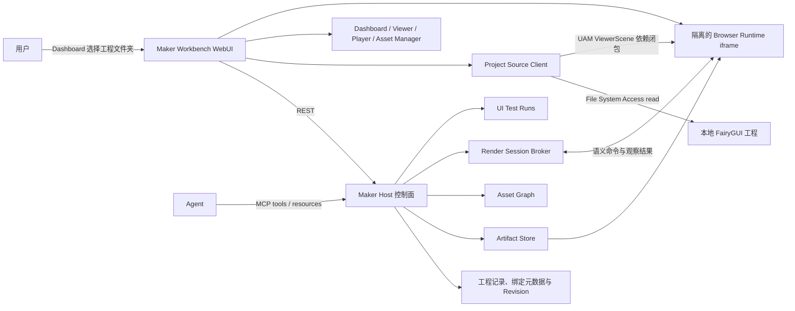
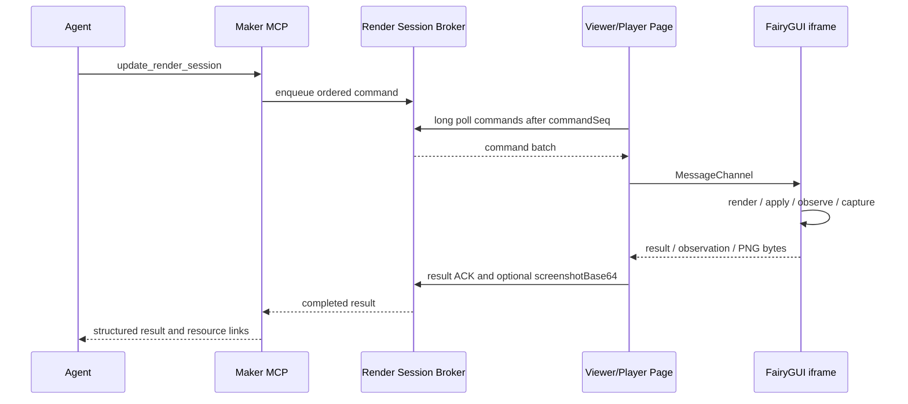

# FairyGUI Maker Workbench 架构与技术栈基线

状态：核心栈、Viewer 与 Artifact-first Player 第一版已落地
更新时间：2026-08-11

本文记录 FairyGUI Maker 浏览器界面层 Maker Workbench 的架构基线和已确认技术选案。Hono、React、TanStack Router/Query/Table/Virtual、Zod、Radix、Pino、react-resizable-panels 与 shadcn/ui 已进入第一版运行链路。

## 1. 产品定义

Maker Workbench（下文简称 Workbench）是 FairyGUI Maker 由 Maker Host 提供的浏览器界面。Dashboard、Viewer、Player 和 Asset Manager 是界面模块，不是四个独立产品或服务。

| 模块 | 输入 | 第一职责 |
|---|---|---|
| Dashboard | 用户授权的 FairyGUI 工程、产物和运行任务 | 创建只读工程绑定，管理活跃及最近工程，展示 revision、权限、发布和诊断状态 |
| Viewer | `projectId + revision + packageId + resourceId` | 预览工程态资源、组件结构和当前可投影效果 |
| Player | `artifactId + runtimeProfile + componentId` | 加载发布态二进制与资源，执行回放、交互和连续 UI 测试 |
| Asset Manager | 工程快照和 artifact manifest | 查询资源引用、反向引用、未使用、重复、冲突和发布映射 |

Viewer 与 Player 必须分开定义：Viewer 直接映射尚未发布的工程，不触发发布；只读约束工程写回，不禁止 render session 内的控件交互。遇到 UAM 或 runtime 暂不支持的语义时返回结构化 diagnostic。Player 只运行固定发布产物，不把工程态结果冒充发布结果。

## 2. 系统边界



### 2.1 控制面

Maker Host 是以下服务状态的唯一所有者：

- Maker 项目注册记录、绑定元数据和 revision。
- 发布产物、manifest 和诊断。
- 浏览器渲染会话、命令和心跳。
- UI 测试运行状态及其证据资源。

浏览器 `Project Source Client` 是用户授权目录能力的唯一持有者。`FileSystemDirectoryHandle` 只保存在同源 IndexedDB，不进入 REST、MCP、Host 或 runtime iframe。Host 继续复用 OpenFairyGUI 的 UAM、发布和错误语义，不在 Maker 中实现第二套工程模型；第一版浏览器目录绑定为只读，不开放工程事务、保存或物化能力。

### 2.2 渲染执行面

FairyGUI 视觉渲染发生在真实浏览器环境中。Workbench 不在 Node 中模拟 Canvas、布局或 FairyGUI runtime。

第一种 runtime profile 固定为 LayaAir 3.3.10 与配套 FairyGUI Web runtime。Viewer 参考 FairyGUI Editor Online 主文档 Canvas 的工程态呈现效果，而不是 `ResourcePreviewController` 资源面板；Maker 自己读取原始工程、构建 UAM `ViewerScene`，再直接创建真实 FairyGUI runtime 对象。FairyGUI Editor Online 不作为代码或运行时依赖。

运行时位于独立 iframe，以隔离 Laya 舞台、资源生命周期和故障。Viewer 不注册 `UIPackage`，也不调用 `publishBrowser`：iframe 每次只接收所选组件的结构化 Scene、递归组件依赖和必要资产字节，不获得工程目录句柄、完整工程或 `.fui`。

Player 使用另一份 iframe runtime。Dashboard 或 Player 页由用户显式选择一个发布目录，浏览器只在本次导入中读取文件并上传给 Host；目录句柄不持久化，Host 也不获得源目录写权限。Host 校验安全相对路径、文件数和容量、`.fui` / `_fui.bytes` magic、包 ID、依赖与组件目录，为每个文件计算 SHA-256，并按整体 digest 固化到本地 Artifact Store。源目录之后发生变化不会修改既有 Artifact。

Player 按 `artifactId + digest` 读取 manifest，预加载图集和声音，再以原生 `fgui.UIPackage` 注册包并创建组件；不经过 Viewer 的 UAM renderer。Player 与 Viewer 只共用 Host Broker、MessageChannel envelope、白名单 operation、observation 和 capture 契约。

Agent 不直接操作 iframe 或 Canvas。它只向 Host 提交语义命令，并读取结构化观察结果。

### 2.3 Viewer / Player 双运行链路

| 维度 | Viewer | Player |
|---|---|---|
| 来源身份 | `projectId + sourceRevision + packageId + componentId` | `artifactId + digest + packageId + componentId` |
| 来源获取 | Dashboard 持久化只读目录句柄，Viewer 按需读取当前工程 | 用户一次性导入发布目录，目录句柄不持久化 |
| Host 持有 | 项目绑定元数据和 render session；不持有目录句柄 | manifest、校验后的不可变文件和 render session |
| 浏览器输入 | Project Source Client 编译的 UAM `ViewerScene` 依赖闭包 | Host 提供的 manifest、二进制包、图集及发布资源 |
| iframe runtime | `viewer-runtime.ts` 直接构造对象，不使用 `.fui` / `UIPackage` | `player-runtime.ts` 使用原生 `UIPackage.addPackage/createObject` |
| 交互语义 | Maker 解释 UAM Controller/Gear/Transition 与常用控件 | 发布 runtime 执行原生 Controller/Gear/Transition 与控件行为 |
| 持久化 | 工程和临时运行态都不写回；session 仅 Host 内存 | Artifact 内容寻址并持久化；session 仍仅 Host 内存 |

当前共享协议为 v4，分成两层：Host 与 Workbench 页面通过 `/api/renderers`、命令长轮询、结果 ACK 和 interaction 上报通信；页面与 iframe 通过同源校验后的 `MessageChannel` 通信。Host 命令统一为 `render / update / observe / capture`，页面再分别转换为 Viewer 的 `render` 或 Player 的 `render-artifact`，因此共享控制面不会把两种 renderer 混为一套。

对应实现边界：`src/web/lib/viewer.ts` 与 `src/runtime/viewer-runtime.ts` 负责工程态；`src/web/lib/player.ts`、`src/runtime/player-runtime.ts` 与 `src/server/artifacts.ts` 负责发布态；`src/server/viewer.ts` 只负责两者共用的 Render Session Broker 和 MCP 工具。

Workbench 保留 `/viewer`、`/player`、`/asset-manager` 作为人工选择入口；Agent 不经过统一工具门户，而由 MCP 直接获得 `/projects/:projectId/viewer`、`/artifacts/:artifactId/player`、`/projects/:projectId/assets` 三类稳定目标深链。需要浏览器运行时或目录授权时，工具返回 `browser_required`、来源身份和对应 URL；按 render session 操作时也返回该会话原本的目标深链，页面重连后 Agent 重新获取新会话再继续。

### 2.4 Dashboard 工程授权与绑定

文件夹授权只发生在 Dashboard 的“创建/打开 FairyGUI 工程”动作中：

1. 用户点击按钮，Dashboard 调用 `showDirectoryPicker({ mode: 'read' })`。
2. Project Source Client 验证选定目录中的 `.fairy` 工程；没有工程或存在歧义时不创建绑定。
3. 浏览器把目录句柄以随机 `bindingId` 保存到同源 IndexedDB，并读取工程生成 UAM 结构快照与资产索引。
4. Dashboard 向 Host 注册 Maker 项目；Host 返回 `projectId` 和项目 Viewer URL。
5. Viewer 只按 `projectId` 消费既有绑定。若浏览器恢复后的 read permission 为 `prompt` 或 `denied`，Viewer 返回 `project_permission_required` 并引导用户回 Dashboard 重新授权，不在 Viewer 或 iframe 内再次打开目录选择器。

目录句柄不能转换为 Node 可用的绝对路径。Host 因此只接收工程绑定元数据和 `sourceRevision`；UAM snapshot 与资产字节留在 Workbench 浏览器内，由 Project Source Client 按需读取并只把选中组件的依赖闭包传给 iframe。第一版不把整个工程复制到 Host，也不把只读绑定伪装成可保存的 OpenFairyGUI 文件会话。

Project Source Client 属于 Workbench Shell 的同源浏览器服务，而不是 Dashboard React 组件本身；切换到 Viewer 路由后它仍可复用已授权句柄。浏览器重启后通过 IndexedDB 恢复 handle，并先查询 read permission。

## 3. 核心领域契约

接口使用稳定 ID，不使用显示名称、任意文件路径或屏幕坐标作为主键。

```ts
type ProjectRef = {
  projectId: string
  revision: number
  sourceRevision: string
}

type RegisteredProject = {
  projectId: string
  fairyguiProjectId: string
  bindingId: string
  name: string
  fairyPath: string
  revision: number
  sourceRevision: string
  sourceOwner: 'browser'
  access: 'read-only'
  status: 'ready' | 'permission-required' | 'stale' | 'failed'
  viewerUrl: string
}

type ResourceRef = {
  packageId: string
  resourceId: string
}

type ArtifactRef = {
  artifactId: string
  digest: string
  runtimeProfile: string
}

type RenderSession = {
  renderSessionId: string
  mode: 'viewer' | 'player'
  projectId?: string
  artifactId?: string
  sourceRevision: string // Viewer 为工程版本；Player 为 artifact digest
  status: 'ready' | 'running' | 'failed' | 'closed'
  stateVersion: number
  commandSeq: number
  interactionSeq: number
}

type RenderOperation =
  | { op: 'set-property'; targetId: string; property: 'text' | 'visible' | 'enabled' | 'selected' | 'value' | 'selectedIndex' | 'icon'; value: string | number | boolean | null }
  | { op: 'set-controller-page'; targetId: string; controllerName: string; pageId: string }
  | { op: 'play-transition'; targetId: string; transitionName: string; times?: number }
  | { op: 'dispatch-event'; targetId: string; event: 'click' | 'input' | 'scroll'; data?: { text?: string; value?: number; selectedIndex?: number; deltaX?: number; deltaY?: number } }

type UpdateRenderSessionInput = {
  renderSessionId: string
  requestId: string
  expectedStateVersion: number
  operations: RenderOperation[]
}
```

当前 v4 不暴露 `settle`；命令结果只确认对应 runtime 已执行本次操作。`idle`、条件等待与事件断言留给后续 `run_ui_scenario`，不提前塞入单次更新接口。

约束：

- 工程态读取固定 `revision`；工程写入继续使用 `expectedRevision`。
- `sourceRevision` 标识浏览器实际读取并用于当前 Canvas 投影的源版本；Host revision 与源目录版本分别记录，不能混用。
- 发布态预览和测试固定 `artifactId + digest + runtimeProfile`。
- 显示对象优先使用 UAM 或发布包对象 ID；名称路径只能作为降级选择器，重名时必须报歧义。
- 坐标操作不是正式测试接口，只保留为无法语义化时的诊断手段。
- `RenderOperation` 只修改当前 render session 的临时运行态；修改工程必须走 OpenFairyGUI transaction，Player 也不得改写固定 artifact。
- `access: 'read-only'` 的浏览器目录绑定禁止 `applyTransaction`、`saveSession` 和 `materializeSession`；未来如需写回，必须建立独立的显式写授权与冲突策略。
- Agent 不能提交任意 JavaScript、表达式求值代码或未经白名单声明的 FairyGUI 属性。

## 4. Render Session 协议

### 4.1 最小生命周期

1. Viewer 已有 Dashboard 工程绑定；Player 已有不可变 Artifact。
2. Agent 或用户打开稳定的 Viewer / Player URL；页面分别读取当前工程或 Artifact manifest。
3. 页面通过 `/api/renderers` 注册 `mode + sourceRevision + protocolVersion`，Host 此时创建 `ready` render session；同一来源的新 renderer 会替换旧会话。
4. 页面与对应 iframe 完成 MessageChannel 握手，并按 `commandSeq` 长轮询 Host 命令。
5. Host 下发语义命令；iframe 执行后返回结果、observation 或 PNG，页面提交 ACK。
6. 人工交互按 `runtimeEventSeq` 回传并推进 `stateVersion`；超时、版本冲突或 runtime 错误会得到明确失败。

第一版使用 HTTP 长轮询和结果回传：没有命令时请求最多挂起一段时间，有命令立即返回。只有实际交互延迟或并发证明长轮询不足时，才改为 WebSocket。

### 4.2 语义命令

- 创建或切换组件。
- 设置 Controller page。
- 播放 Transition；停止和条件等待属于后续会话编排能力。
- 按对象 ID click、输入或滚动。
- 读取当前对象树、控件状态、Controller page 和最近运行时交互事件。
- 获取截图和结构化对象树。

### 4.3 观察结果

- 对象 ID、名称、类型、bounds、visible、text。
- Controller、page 和 Transition 状态。
- 缺失资源、加载超时和 runtime error。
- PNG 截图结果、事件日志和结构化诊断。

如果对应页面尚未注册 renderer，Agent 工具返回 `browser_required` 和稳定的 Viewer / Player URL，不能伪造渲染完成状态。Viewer 页面发现 read permission 失效时显示 `project_permission_required` 并引导用户返回 Dashboard；授权动作不能由 Agent 代替用户完成。

### 4.4 数据通道

Viewer 与 Player 共用同一条 render session 数据通道，区别只在 source 类型和允许执行的操作。Agent 不直接调用浏览器或 iframe；MCP tools 与 WebUI REST 都进入 Host 内的同一个 Render Session Service。Viewer 页面把鼠标、键盘、滚轮产生的语义事件回传 Host；Agent 命令则调用相同的控件状态处理函数，因此两种输入对 Button、Controller/Gear、List/Tree、ComboBox、Slider、TextInput 和 Scroll 产生一致的内存态结果。



Workbench 页面负责认证、领取命令和上传结果；隔离 iframe 只实现 FairyGUI runtime adapter。页面与 iframe 使用带 `renderSessionId`、协议版本和消息类型的 `MessageChannel` envelope，并校验消息来源。

TanStack Query 只管理 Dashboard 和页面展示所需的服务状态，不承载 renderer 命令队列。命令通道需要严格顺序、ACK 和幂等，必须由独立的 Renderer Client 循环处理。

### 4.5 更新顺序、幂等与数据绑定

- Host 为命令分配严格递增的 `commandSeq`；renderer 只能按序执行并回传 ACK。
- 同一个 `operations` 批次在一次提交中应用；成功的 render/update 和人工交互各推进一次 `stateVersion`，observe/capture 不推进版本。
- `requestId` 用于安全重试；同一 ID 和同一 payload 返回原 promise，同一 ID 换 payload 则报冲突。每个 render session 只保留最近 256 个 request ID，已完成的旧项按插入顺序淘汰，未完成请求不会被淘汰。
- `expectedStateVersion` 阻止 Agent 更新覆盖其他输入；observe/capture 用 `afterStateVersion` 拒绝读取尚未到达的版本。
- Host 缓存最新 observation 和最近交互摘要；render session 与截图都不跨 Host 重启持久化。

第一版只以稳定对象 ID 的白名单语义操作驱动 UI，不接受业务 JSON、任意 JavaScript、表达式或显示名称猜测。

### 4.6 截图协议

Viewer 与 Player 使用同一个截图命令：

```ts
type CaptureRenderScreenshotInput = {
  renderSessionId: string
  requestId: string
  afterStateVersion: number
}
```

`afterStateVersion` 是截图的新鲜度下限：当前会话尚未到达该版本时，Host 返回 `state_version_not_reached`，不会返回旧图。

第一版只截取实际 Laya 舞台：Viewer 和 Player runtime 都调用 `Laya.stage.drawToCanvas()` 并生成 PNG。Viewer 的闭包资产通过结构化克隆进入 iframe，并以本地 Blob URL 解码；外部 URL 不纳入只读工程依赖，避免污染 Canvas。非 origin-clean Canvas 会拒绝像素读取或 `toBlob()`：[HTMLCanvasElement.toBlob](https://developer.mozilla.org/en-US/docs/Web/API/HTMLCanvasElement/toBlob)。

页面把 PNG 转为 `screenshotBase64` 随命令 ACK 返回 Host；Host 不把这段 Base64 放进文本结果，而是立即返回 MCP `image/png` content，并在文本中标记 `screenshot: { attached: true, mimeType: "image/png" }`。组件证据应使用该 Canvas 截图；浏览器整页截图只用于审查 Workbench 自身界面。当前不创建 `ScreenshotRef` 或 resource URI，持久截图、viewport/page 截图和 Playwright 无人值守证据图留给后续：[Playwright screenshots](https://playwright.dev/docs/screenshots)。

后续连续性 UI 测试会复用该通道编排 update、wait、interaction 和 capture；当前尚未实现 `run_ui_scenario`。

## 5. 对外接口

### 5.1 WebUI REST

REST 供 Workbench WebUI 和 Renderer Client 使用。当前接口为：

- `GET /api/status`
- `GET /api/sessions`
- `POST /api/projects`
- `GET /api/projects`
- `GET /api/projects/:projectId`
- `GET /api/projects/:projectId/asset-analysis`
- `PUT /api/projects/:projectId/asset-analysis`
- `POST /api/renderers`
- `GET /api/render-sessions/:renderSessionId`
- `GET /api/render-sessions/:renderSessionId/commands?after={commandSeq}`
- `POST /api/render-sessions/:renderSessionId/results`
- `POST /api/render-sessions/:renderSessionId/interactions`
- `POST /api/import-drafts`
- `GET /api/import-drafts`
- `GET /api/import-drafts/:draftId`
- `DELETE /api/import-drafts/:draftId?expectedRevision={revision}`
- `POST /api/import-drafts/:draftId/parse`
- `POST /api/import-drafts/:draftId/plan`
- `POST /api/import-drafts/:draftId/compile`
- `POST /api/import-drafts/:draftId/materialize`
- `POST /api/artifact-imports`
- `PUT /api/artifact-imports/:importId/files?path={relativePath}`
- `POST /api/artifact-imports/:importId/complete`
- `GET /api/artifacts`
- `GET /api/artifacts/:artifactId`
- `GET /api/artifacts/:artifactId/files/*`

REST handler 与 MCP tools 调用同一组应用函数，不分别实现发布、引用和渲染语义。

### 5.2 Agent MCP tools

现有 OpenFairyGUI MCP tools 继续处理底层工程会话和事务。Maker 只增加高层任务工具：

| 工具 | 结果 |
|---|---|
| `list_viewer_components` | 列出 Viewer 工程、稳定入口及当前 renderer 上报的 package/component ID；未打开 Viewer 时提示 `browserRequired` |
| `render_component_preview` | 在已打开 Viewer 渲染工程组件；可同时返回 PNG |
| `inspect_project_assets` | 返回固定 revision 的资源健康摘要；传入 package/resource ID 时返回该资源的 incoming/outgoing 引用和问题 |
| `list_artifact_components` | 列出不可变 Artifact 及其 package/component ID |
| `open_artifact_player` | 返回 Player URL 和当前 render session（若页面已打开） |
| `render_artifact_component` | 在已打开 Player 通过原生 `UIPackage` 渲染组件；可同时返回 PNG |
| `update_render_session` | 应用白名单 operation，返回新的 state version 或版本冲突 |
| `get_render_observation` | 返回当前对象树、控件状态和 Controller page |
| `capture_render_screenshot` | 返回当前 state version 对应的 MCP `image/png` content |

`publish_artifact` 和 `run_ui_scenario` 尚未实现，保留在后续阶段。

### 5.3 MCP resources

Viewer / Player 当前没有新增自定义 MCP resource。Artifact manifest 和文件由鉴权 REST 提供，observation 随工具结果返回，截图直接返回 MCP image content。只有出现跨重启证据保存或大型结构按需读取需求时，才增加 `fairygui://` resource URI。

## 6. Asset Manager 第一版

第一版已在 `/asset-manager` 和 `/projects/:projectId/assets` 落地，不建立图数据库。浏览器 Project Source Client 对固定 project revision 按需读取 UAM 和资源字节，计算引用与 SHA-256；Host 只接收经过 Zod 校验、不含目录句柄和资源字节的紧凑分析快照。工程 revision 变化时旧快照立即失效。

分析复用 Viewer 的资源依赖收集器，并沿用 FairyGUI Editor Online 已有的以下语义：

- incoming/outgoing 资源引用。
- 删除前的依赖保护。
- 未使用资源检查。
- SHA-256 完全重复资源检查。
- 同包路径和名称冲突检查。

首版界面使用资源列表、incoming/outgoing 详情和工程问题清单；`inspect_project_assets` 复用同一份 revision 快照供 Agent 查询。删除保护当前体现为影响信息，尚不开放删除、重命名、合并或引用重写。只有项目规模证明按需扫描或列表不足时，再增加增量索引或图形视图。

## 7. 技术栈选案

### 7.1 约束

- 当前 Maker Host 已经使用 Node 原生 HTTP、MCP TypeScript SDK 和 OpenFairyGUI backend。
- FairyGUI Editor Online 已验证 Vite、TypeScript、LayaAir 3.3.10 和 FairyGUI Web runtime 的浏览器链路。
- Workbench 是 localhost 优先的单用户工具，不需要 SSR、云数据库或微服务。
- WebUI 需要可访问的 DOM 管理界面；FairyGUI Canvas 只承担项目资源渲染。
- Agent 接口需要严格的输入校验、稳定 ID、revision 和可复现 artifact。

### 7.2 已确认组合

| 层 | 推荐 | 理由 |
|---|---|---|
| 运行环境 | Node.js `>=22.18`、pnpm | 与 Editor Online 的最低版本统一；当前工作环境可直接运行 |
| 语言 | 前后端 TypeScript strict | 共享领域契约，降低 REST、MCP 与 iframe 协议漂移 |
| 服务端运行 | Vite Node bundle 输出 `dist/server/index.js`；`tsx` 仅用于开发与测试 | npm CLI 不依赖 TypeScript 源码或 devDependency |
| HTTP Host | Hono + `@hono/node-server` | Web Standard API、类型化路由和轻量中间件；继续只绑定 localhost |
| MCP | `@modelcontextprotocol/sdk` + `@openfairygui/mcp` | 复用当前共享 BackendRuntime 和 Streamable HTTP 实现 |
| 日志 | Pino | Host 使用结构化日志，避免为日志格式维护自定义层 |
| 输入校验 | Zod + `@hono/zod-validator` | 启动参数和 HTTP trust boundary 共用 schema 语义 |
| WebUI | React 19 + TypeScript | 生态完整，适合管理型 DOM UI 和后续 Viewer 工具扩展 |
| Web 构建 | Vite 8 | 与 Editor Online 已验证链路一致，支持 SPA 与独立 runtime HTML entry |
| 路由 | TanStack Router | 类型安全的 `/projects/:projectId/viewer` 与 `/artifacts/:artifactId/player` 等稳定入口，可直接由 Agent 返回 |
| 服务状态 | TanStack Query | 统一 Host、MCP、project 和 artifact 的轮询、缓存及错误状态 |
| 数据视图 | TanStack Table + Virtual | headless 表格与大列表虚拟化，样式和 DOM 结构由 Workbench 控制 |
| UI 组件 | shadcn/ui，Radix primitives | 组件源码归项目所有；首批加入 Button、Badge、Card、Table、Tooltip、Resizable |
| 布局 | `react-resizable-panels` | Viewer、Player、Inspector 等工作台区域可拖拽分栏 |
| 样式 | Tailwind CSS 4 + shadcn CSS variables | 与 shadcn 官方 Vite 方案一致，保留可替换的 design tokens |
| 渲染 runtime | 隔离 iframe + 冻结的 LayaAir 3.3.10/FairyGUI Web | 复用已有验证基础，避免同时适配多个引擎 |
| 后端测试 | `node:test` | 当前已使用，无需替换 |
| 前端验证 | TypeScript strict + Vite build + 浏览器 runtime harness | 覆盖 iframe 启动、组件实例化、语义属性更新和 PNG 截图；暂不新增测试框架 |
| 浏览器验收 | Playwright Chromium 发布烟测 | 在真实 Viewer 与压缩 `.fui` Player 中验证组件、observation 和 MCP PNG |
| 持久化 | Host 内存会话 + IndexedDB directory handle + 本地 artifact 目录和 manifest | Artifact 在每次启动时重校验；文件夹授权只存在于同源浏览器 |
| Host/浏览器通信 | REST + HTTP 长轮询；iframe 内 `MessageChannel` | 命令按序 ACK，首版不需要 GraphQL、WebSocket 或自定义 RPC 框架 |

Hono 的 Node adapter 直接承载 Web Standard `Request/Response`，MCP SDK 的 Web Standard Streamable HTTP transport 因而不需要再包一层 Node request/response adapter：[Hono Node.js](https://hono.dev/docs/getting-started/nodejs)。WebUI 通过 Hono RPC client 复用路由响应类型：[Hono RPC](https://hono.dev/docs/guides/rpc)。

TanStack Router、Query、Table 和 Virtual 分别处理 URL、服务状态、表格模型和可见区域渲染；不再自建对应基础设施：[Router type safety](https://tanstack.com/router/latest/docs/guide/type-safety)、[Query overview](https://tanstack.com/query/latest/docs/framework/react/overview)、[Table overview](https://tanstack.com/table/latest/docs/overview)、[Virtual introduction](https://tanstack.com/virtual/latest/docs/introduction)。shadcn/ui 按 Vite + Tailwind CSS 4 官方方式初始化，并选择 Radix base：[shadcn/ui for Vite](https://ui.shadcn.com/docs/installation/vite)、[CLI v4 base selection](https://ui.shadcn.com/docs/changelog/2026-03-cli-v4)。

Node 原生 TypeScript 类型擦除会忽略 `tsconfig.json`，且不支持 enum、运行时代码 namespace、参数属性等需要转换的语法，因此本项目推荐使用 `tsx` 获得完整 TypeScript 行为：[Node.js TypeScript](https://nodejs.org/api/typescript.html)。

Playwright 自带截图基线与比较能力，但官方同时说明结果会受操作系统、浏览器、字体和硬件影响。因此视觉回归必须固定运行环境，不能把任意开发机截图当成稳定基线：[Playwright visual comparisons](https://playwright.dev/docs/test-snapshots)。

### 7.3 暂不选择

| 候选 | 暂不选择的原因 | 重新考虑条件 |
|---|---|---|
| 继续手写 DOM | 四个模块会产生重复渲染、路由和生命周期代码 | 仅保留当前第一版 Console，不扩展 Workbench 时 |
| Next.js / SSR | localhost 工作台没有 SEO 或服务端页面需求 | 出现公开内容站或必须服务端渲染的页面 |
| Redux / Zustand | 服务端状态由 Query 管理，首版没有复杂客户端写状态 | 出现跨模块编辑草稿或复杂本地状态机 |
| MUI / Ant Design | shadcn/Radix 已覆盖首批组件且源码可控 | 大量企业组件需求超过本地维护成本 |
| GraphQL | 领域查询尚不复杂，REST 与 MCP 已覆盖两个消费者 | 出现大量组合查询且 REST 端点持续膨胀 |
| WebSocket | 单机低并发下 HTTP 轮询足够 | 实测延迟、命令吞吐或多 renderer 并发不达标 |
| SQLite/PostgreSQL | 会话和短期产物可由内存及文件系统管理 | 需要跨重启任务历史、全文检索或多用户并发 |
| Cytoscape/D3 | Asset Manager 第一版使用列表即可回答影响关系 | 用户明确需要大型交互图并验证列表不足 |

## 8. 建议目录

保持单 package，不提前拆 monorepo：

```text
src/
├─ server/          Maker Host、REST、MCP、artifact 与 render session
├─ contracts/       REST、MCP 和 runtime bridge 的共享 TypeScript schema
├─ web/             React Maker Workbench shell、Project Source Client、shadcn 组件与产品模块
└─ runtime/         独立 iframe entry 与 Laya/FairyGUI bridge
test/               Node Host 测试
```

只有第二种 runtime profile 真正开始实现时，才把 `runtime/` 进一步拆成 adapter package。

## 9. 第一版实现状态

已落地 Dashboard 只读工程绑定与发布目录导入、`/projects/:projectId/viewer`、`/artifacts/:artifactId/player`、原始工程 UAM Viewer、内容寻址 Artifact Store、原生 UIPackage Player、组件虚拟列表、缩放/背景/Transition 播放/PNG 截图，以及 Host 内存 Render Session Broker。Viewer 不发布工程、不生成或读取 `.fui`；Player 不读取或修改工程目录，只消费固定 Artifact。Artifact 在 Host 启动时重新校验实际文件并忽略被篡改内容，中断导入目录自动清理。浏览器通过 HTTP 长轮询领取严格递增命令，并用 MessageChannel 顺序驱动各自 iframe；MCP session 和 request ID 缓存均有固定上限。

Maker MCP 已增加 `list_viewer_components`、`render_component_preview`、`list_artifact_components`、`open_artifact_player`、`render_artifact_component`、`update_render_session`、`get_render_observation` 和 `capture_render_screenshot`。组件使用 package/component resource ID 定位；临时更新只接受白名单 `set-property`、`set-controller-page`、`play-transition` 和 `dispatch-event`，不接受任意 JavaScript、坐标操作或显示名称猜测。`get_render_observation` 返回对象树、控件状态和 Controller page；未打开对应 Viewer / Player 时返回 `browser_required` 和稳定入口 URL。

当前截图直接作为 MCP image content 返回，不做跨重启持久化；Render Session 也只保存在 Host 内存。下一阶段再补 ScreenshotRef digest/resource、条件等待/事件断言和 `run_ui_scenario`。Viewer 的 ComboBox 弹层由 Maker 提供通用工程态交互，未被 UAM 表达的业务脚本和宿主绑定不执行；发布后原生行为由 Player 验证。

## 10. 下一轮决策

核心前后端栈、LayaAir 3.3.10/FairyGUI Web runtime、Dashboard 授权边界、Artifact-first Player 和 render session 数据通道已经完成第一版。Viewer 是 Maker 自有的 UAM Scene compiler 与直接 renderer；Player 是独立的原生 UIPackage runtime。FairyGUI Editor Online 只提供主 Canvas 的行为和视觉参考，不复用其 EditorShell、Resource Preview UI 或模块导出。下一轮决策聚焦自动发布接入、截图持久化和连续 UI 场景测试。
