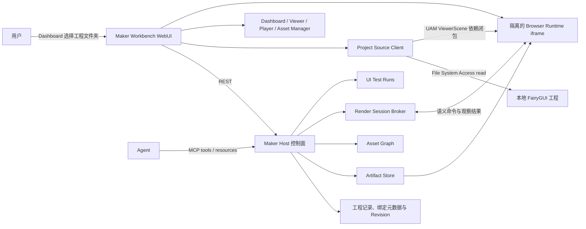
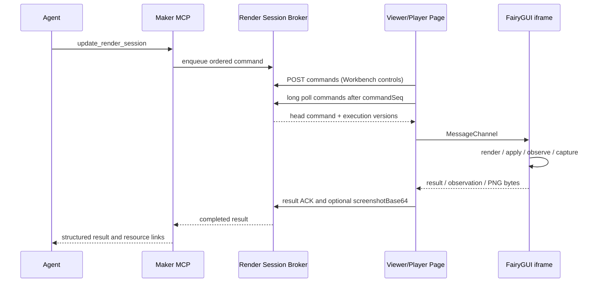

# FairyGUI Maker Workbench 架构与技术栈基线

状态：核心栈、Viewer 与 Artifact-first Player 第一版已落地
更新时间：2026-09-04

本文记录 FairyGUI Maker 浏览器界面层 Maker Workbench 的架构基线和已确认技术选案。Hono、React、TanStack Router/Query/Table/Virtual、Zod、Radix、Pino、react-resizable-panels 与 shadcn/ui 已进入第一版运行链路。

## 1. 产品定义

Maker Workbench（下文简称 Workbench）是 FairyGUI Maker 由 Maker Host 提供的浏览器界面。Dashboard、Viewer、Player 和 Asset Manager 是界面模块，不是四个独立产品或服务。

| 模块 | 输入 | 第一职责 |
|---|---|---|
| Dashboard | 用户授权的 FairyGUI 工程、产物和运行任务 | 创建只读工程绑定，管理活跃及最近工程，展示 revision、权限、发布和诊断状态 |
| Viewer | `projectId + revision + packageId + resourceId` | 预览工程态资源、组件结构和当前可投影效果 |
| Player | `artifactId + runtimeProfile + componentId` | 加载发布态二进制与资源，执行回放、交互和连续 UI 测试 |
| Asset Manager | 工程快照和 artifact manifest | 查询资源引用、反向引用、未使用、重复、冲突和发布映射 |

Viewer 与 Player 必须分开定义：Viewer 直接映射尚未发布的工程，不触发发布；只读约束工程写回，不禁止 render session 内的控件交互。遇到 UAM 或 runtime 暂不支持的语义时返回结构化 diagnostic。Player 只运行固定发布产物，不把工程态结果冒充发布结果。

## 2. 系统边界



### 2.1 控制面

Maker Host 是以下服务状态的唯一所有者：

- Maker 项目注册记录、绑定元数据和 revision。
- 发布产物、manifest 和诊断。
- 浏览器渲染会话、命令和心跳。
- UI 测试运行状态及其证据资源。

浏览器 `Project Source Client` 是用户授权目录能力的唯一持有者。`FileSystemDirectoryHandle` 只保存在同源 IndexedDB，不进入 REST、MCP、Host 或 runtime iframe。Host 继续复用 OpenFairyGUI 的 UAM、发布和错误语义，不在 Maker 中实现第二套工程模型；第一版浏览器目录绑定为只读，不开放工程事务、保存或物化能力。

### 2.2 渲染执行面

FairyGUI 视觉渲染发生在真实浏览器环境中。Workbench 不在 Node 中模拟 Canvas、布局或 FairyGUI runtime。

第一种 runtime profile 固定为 LayaAir 3.3.10 与配套 FairyGUI Web runtime。Viewer 参考 FairyGUI Editor Online 主文档 Canvas 的工程态呈现效果，而不是 `ResourcePreviewController` 资源面板；Maker 自己读取原始工程、构建 UAM `ViewerScene`，再直接创建真实 FairyGUI runtime 对象。FairyGUI Editor Online 不作为代码或运行时依赖。

运行时位于独立 iframe，以隔离 Laya 舞台、资源生命周期和故障。Viewer 不注册 `UIPackage`，也不调用 `publishBrowser`：iframe 每次只接收所选组件的结构化 Scene、递归组件依赖和必要资产字节，不获得工程目录句柄、完整工程或 `.fui`。

Player 使用另一份 iframe runtime。Dashboard 或 Player 页由用户显式选择一个发布目录，浏览器只在本次导入中读取文件并上传给 Host；目录句柄不持久化，Host 也不获得源目录写权限。Host 校验安全相对路径、文件数和容量、`.fui` / `_fui.bytes` magic、包 ID、依赖与组件目录，为每个文件计算 SHA-256，并按整体 digest 固化到本地 Artifact Store。同内容复用字节，每次导入独立记录名称、来源和时间；源目录之后发生变化不会修改既有 Artifact。

Player 的父页面按 `artifactId + digest` 读取 manifest 和资源，校验大小与 SHA-256 后通过 MessageChannel 转移字节；iframe 预加载图集，再以原生 `fgui.UIPackage` 注册包并创建组件，不直接请求 Host 文件 API，也不经过 Viewer 的 UAM renderer。Player 与 Viewer 共用 Host Broker、Renderer 交付循环、MessageChannel envelope、白名单 operation、observation 和 capture 契约。

Agent 不直接操作 iframe 或 Canvas。它只向 Host 提交语义命令，并读取结构化观察结果。

### 2.3 Viewer / Player 双运行链路

| 维度 | Viewer | Player |
|---|---|---|
| 来源身份 | `projectId + sourceRevision + packageId + componentId` | `artifactId + digest + packageId + componentId` |
| 来源获取 | Dashboard 持久化只读目录句柄，Viewer 按需读取当前工程 | 用户一次性导入发布目录，目录句柄不持久化 |
| Host 持有 | 项目绑定元数据和 render session；不持有目录句柄 | manifest、校验后的不可变文件和 render session |
| 浏览器输入 | Project Source Client 编译的 UAM `ViewerScene` 依赖闭包 | Host 提供的 manifest、二进制包、图集及发布资源 |
| iframe runtime | `viewer-runtime.ts` 直接构造对象，不使用 `.fui` / `UIPackage` | `player-runtime.ts` 使用原生 `UIPackage.addPackage/createObject` |
| 交互语义 | Maker 解释 UAM Controller/Gear/Transition 与常用控件 | 发布 runtime 执行原生 Controller/Gear/Transition 与控件行为 |
| 持久化 | 工程和临时运行态都不写回；session 仅 Host 内存 | Artifact 内容寻址并持久化；session 仍仅 Host 内存 |

当前共享协议为 v6，分成两层：Host 与 Workbench 页面通过 `/api/renderers`、命令长轮询、结果 ACK 和 interaction 上报通信；Renderer 与不透明源 iframe 通过绑定父窗口、来源和一次性 nonce 的 `MessageChannel` 通信。Host 命令统一为 `render / update / view / observe / capture`，Renderer 再分别转换为 Viewer 的 `render` 或 Player 的 `render-artifact`，因此共享控制面不会把两种 renderer 混为一套。Workbench 控件不持有可直接修改 iframe 的 FrameSession。

对应实现边界：`src/web/lib/viewer.ts` 与 `src/runtime/viewer-runtime.ts` 负责工程态；`src/web/lib/player.ts`、`src/runtime/player-runtime.ts` 与 `src/server/artifacts.ts` 负责发布态；`src/server/viewer.ts` 只负责两者共用的 Render Session Broker 和 MCP 工具。

Workbench 保留 `/viewer`、`/player`、`/asset-manager` 作为人工选择入口；Agent 不经过统一工具门户，而由 MCP 直接获得 `/projects/:projectId/viewer`、`/artifacts/:artifactId/player`、`/projects/:projectId/assets` 三类稳定目标深链。需要浏览器运行时或目录授权时，工具返回 `browser_required`、来源身份和对应 URL；按 render session 操作时也返回该会话原本的目标深链，页面重连后 Agent 重新获取新会话再继续。

### 2.4 Dashboard 工程授权与绑定

文件夹授权只发生在 Dashboard 的“创建/打开 FairyGUI 工程”动作中：

1. 用户点击按钮，Dashboard 调用 `showDirectoryPicker({ mode: 'read' })`。
2. Project Source Client 验证选定目录中的 `.fairy` 工程；没有工程或存在歧义时不创建绑定。
3. 浏览器把目录句柄以随机 `bindingId` 保存到同源 IndexedDB，并读取工程生成 UAM 结构快照与资产索引。
4. Dashboard 向 Host 注册 Maker 项目；Host 返回 `projectId` 和项目 Viewer URL。
5. Viewer 只按 `projectId` 消费既有绑定。若浏览器恢复后的 read permission 为 `prompt` 或 `denied`，Viewer 返回 `project_permission_required` 并引导用户回 Dashboard 重新授权，不在 Viewer 或 iframe 内再次打开目录选择器。

目录句柄不能转换为 Node 可用的绝对路径。Host 因此只接收工程绑定元数据和 `sourceRevision`；UAM snapshot 与资产字节留在 Workbench 浏览器内，由 Project Source Client 按需读取并只把选中组件的依赖闭包传给 iframe。第一版不把整个工程复制到 Host，也不把只读绑定伪装成可保存的 OpenFairyGUI 文件会话。

Project Source Client 属于 Workbench Shell 的同源浏览器服务，而不是 Dashboard React 组件本身；切换到 Viewer 路由后它仍可复用已授权句柄。浏览器重启后通过 IndexedDB 恢复 handle，并先查询 read permission。

### 2.5 有界上传管线（批次 10）

认证后的 POST/PUT/PATCH 请求先经过实际字节计数，再交给 JSON/MCP/multipart 解析器或 Store。`Content-Length` 只用于提前拒绝；缺失或伪报长度仍不能绕过流内限制。被拒绝的请求关闭连接，不继续复用未读完的上传流。

| 边界 | 固定上限 |
|---|---|
| REST/MCP JSON（含 renderer 截图 Base64 envelope） | 16 MiB；截图原有 14,000,000 字符校验仍保留 |
| Artifact 单文件 / 单次导入 | 128 MiB / 512 MiB，最多 5,000 文件 |
| Import Draft 上传源 | 总计 530 MiB，最多 5,000 文件 |
| Visual Evidence multipart | 48 MiB + 64 KiB；恰好一个 report 和各一张 reference/capture/diff PNG，每张最多 16 MiB |
| 活跃二进制与视觉上传 | Host 合计 4 个；每个 Import/Draft 同时仅写一个源文件 |
| 待完成上传 | Artifact 与 Draft 各最多 16 个；声明容量分别累计最多 512 MiB、530 MiB |
| 请求体接收时限 / 待完成空闲有效期 | 5 分钟 / 30 分钟，成功写入文件后续期 |

二进制直接流入独立 `.uploads/<uuid>.part`，边写边计数和计算 SHA-256，文件 flush、实际大小与摘要校验通过后才原子改名。超限返回 `413`，短传返回 `400`，同路径不同内容重试返回 `409`；相同内容重试成功且不覆盖既有文件。Artifact 创建 manifest 的每项必须提供 `{ path, size, sha256 }`（64 位小写十六进制），Workbench 会顺序校验文件后再创建 Import。Draft 保持 `{ path, size }` 协议，重试时仍比较实际内容摘要。

取消 Artifact 使用 `DELETE /api/artifact-imports/:importId`；取消 Draft 沿用 `DELETE /api/import-drafts/:draftId?expectedRevision=...`。取消、断流或超时会关闭流并清理临时文件；超时返回 `408`，容量或并发已满返回 `503`。Artifact 完成阶段与写入、取消互斥，Host 同时只 finalize 一个 Artifact，忙碌返回 `409`。Draft 沿用已有变更队列。Host 每分钟及创建新上传前清理过期上传，关闭时中止活跃二进制流；重启清理 Artifact 未完成目录与 Draft 孤立 `.part`。已完成上传的 Draft 仍保留原有七天有效期。

multipart 继续使用原生 `formData()`，但解析前已有固定总量限制，并非全流式解析器；浏览器 SHA-256 也仅逐个缓冲已限制为 128 MiB 的文件。容量配额针对待完成源文件声明，不包括已完成 Artifact/生成工程的长期占用或有界的重试暂存副本。FUI 解压与解码像素预算由批次 11 单独提供；证据持久化事务仍属后续工作，不把上传限制当作这些边界的保护。

验证入口：`test/uploads.test.ts` 覆盖实际 HTTP、Chunked/伪报长度、超限、摘要冲突、取消、孤立临时文件、容量、TTL、finalize 互斥和并发释放；`pnpm test:browser` 覆盖浏览器摘要上传、FIG Draft、Visual Evidence 与 Viewer/Player（目录选择器结果为测试注入，不代表系统授权弹窗已自动验证）。

### 2.6 Runtime 资源预算（批次 11）

Viewer 与 Player 复用 `src/runtime/resource-budget.ts`，上传成功不代表资源一定能在浏览器中播放。超限返回 `resource_budget_exceeded: <资源名>`；失败的 render 回收当前场景、未挂接对象、纹理缓存与 Blob URL，后续合法 render 可以继续使用同一 iframe。

| 运行时边界 | 固定上限 |
|---|---|
| 单个编码文件 / 一次场景或 Artifact 的编码资源 | 128 MiB / 256 MiB |
| FUI 解压 | 包头与全部包解压结果累计 256 MiB；每包压缩体最多膨胀 100 倍 |
| 单次 fetch + 解压或图片加载 | 15 秒；流最多 16,384 块，逐块检查实际字节；重连/离开页面中止加载 |
| 单张图片 / 截图 | 宽高各最多 8,192，面积最多 8,388,608 像素 |
| 已解码图片的 RGBA 估算 / 纹理句柄 | 累计 128 MiB / 1,024 个（包含 atlas 子纹理、MovieClip 帧、位图字体字形） |
| 场景 | 最多 5,000 个实际创建对象，组件/显示树深度最多 64；重复引用按展开后的实例计数 |
| Observation | 一次结果合计最多 5,000 个对象节点、10,000 个条目（含 Controller/Page/Transition）、64 层；单字符串 16,384 个 UTF-16 code unit，所有字符串累计 1,048,576 个 |
| 源元数据 | 同样限制字符串、数组和总条目；结构深度 128。Player 在原生包解析前检查字符串表，所有包累计最多 10,000 个字符串表条目、5,000 个资源 |

PNG 在任何解码器运行前检查 IHDR；PNG/JPEG 的完整校验复用 Core 并放入可终止 Worker。静态 SVG 复用 Core 安全校验，再固定经过预算检查的栅格尺寸；静态 WebP 检查 RIFF canvas 与实际位流的尺寸（[格式规范](https://developers.google.com/speed/webp/docs/riff_container)）。APNG、动态 WebP 及无法安全预检的图片拒绝播放。图片只从已校验的字节生成 Blob 后顺序解码，Player 不再直接把任意图片 URL 交给解码器。原生外部 Loader/3D URL 被拒绝；底层资源加载器也只接受当前场景登记的 URL，未登记的富文本内嵌图片/模板视为缺失资源，不触发额外下载和解码。

Player 仍使用原生 `UIPackage`，在工厂、组件构造与纹理创建边界计数；不另写一套 FUI 组件解析器，也不改动冻结的 vendor 文件。构造失败会恢复原生 constructing 计数并回收部分实例。Observation 超限明确失败，不截断、更不把不完整树伪装为完整结果；批量 operation 的子结果与末尾 observation 共用同一预算。

这些是输入与资源句柄预算，不是浏览器进程的硬内存沙箱：纹理估算不含驱动/mipmap/字体排版等额外开销；音频不再预解码，PCM 时长预算和组件级按需资源闭包仍未实现。ACK/outbox 由批次 12 提供，Broker 状态统一见批次 13；iframe 权限隔离见批次 16。

验证：`test/runtime-budget.test.ts` 覆盖压缩炸弹、绝对/累计输出限制、流中断/超时/块数、图像尺寸、纹理、节点、Observation 与稀疏元数据；`pnpm test:browser` 中的 `scripts/runtime-budget-smoke.ts` 验证真实 Viewer/Player 的超深/展开超量场景、巨型 PNG/SVG、MovieClip 与原生 atlas 子纹理上限、正常 PNG/JPEG/WebP/SVG、Observation 拒绝、重连后的迟到解码回收及 Artifact A→B→正常场景的缓存释放。

### 2.7 Renderer 可靠交付（批次 12）

Viewer/Player 的 Host 通信统一到 `src/web/lib/renderer-delivery.ts`，各自只提供 iframe 命令执行函数，不合并两种 runtime。每次只执行一条 Broker 命令，并保留该次成功或失败结果的原始 JSON，直到收到匹配 `commandSeq + requestId` 的 ACK；网络故障只重新 POST 同一结果，不重新操作 iframe。ACK 后重新领取命令，不继续使用可能已过期的旧批次。

Host 为结果保留规范化 JSON 的 SHA-256 receipt：对象字段顺序不影响摘要，数组顺序仍有意义。同一会话、序号、request ID 和结果可重复提交，返回 `200 { accepted: true, commandSeq, requestId }`，不再次 resolve/reject 或推进版本；不同结果、错误身份、乱序或过期 receipt 返回 `409 result_conflict`。成功和失败结果都遵守此规则。命令 request ID 的 fingerprint 也使用相同规范化规则。

Interaction 在注册请求前就接入 outbox，严格按序发送，队头收到 `200 { accepted: true, runtimeEventSeq, session }` 才移除。Host 对相同序号和相同 payload 幂等接受，不同 payload 返回 `409 interaction_conflict`，缺失前序返回 `409 interaction_sequence_gap`；`GET /api/render-sessions/:id` 的 `session.lastAcceptedRuntimeEventSeq` 可查询当前已接受位置。不会跳号或伪造丢失事件来修复 gap。

| 交付边界 | 行为 / 上限 |
|---|---|
| 客户端结果缓存 | 同时仅 1 个已执行结果；含失败结果，ACK 后释放 |
| Interaction outbox | 当前页面内存最多 256 个事件、合计 1 MiB UTF-8 JSON；单事件最多 64 KiB |
| Host interaction 校验 | target ID 128 字符；data 最多 32 字段、key 128 字符、单字符串 16,384 code unit；事件 envelope 64 KiB |
| Host receipt | 每会话结果、interaction 各最近 256 个摘要，不重复保存截图；淘汰项的重放明确冲突 |
| 重试 | 网络/响应体中断、408、429、5xx 按 250 ms→2 s 退避；连续失败达到 60 s 后停止（请求自身时限可能增加最多一个请求周期） |
| HTTP 时限 | 长轮询 35 s（Host 等待最多 25 s），POST/注册 10 s；其他 4xx、错误 ACK、gap/队列超限立即停止 |
| 命令超时 | 沿用入队起 30 s；未收到结果时执行状态未知，关闭整个会话并拒绝剩余 pending，不复用可能已变化的运行态 |
| 关闭 / TTL | 页面卸载、切换或 stop 中止 poll/POST/退避，移除 interaction handler，并以 keepalive DELETE 关闭 Host 会话；关闭请求失败由 5 分钟不活跃 TTL 兜底，每分钟及访问时检查 |

严重断线、Host 重启、会话替换、gap 或超限都会移除 AGENT READY，显示原因与“重新连接”。重新连接会重新加载页面、重置 iframe 并注册新会话；浏览器后退缓存（bfcache）恢复已关闭的页面时也会重新加载。Agent 必须重新获取 session ID，不自动重放旧会话操作。正常短暂断网可以在同一页面恢复交付，但不承诺跨页面刷新/浏览器崩溃/Host 重启的 exactly-once，不保存持久 outbox。

验证：`test/renderer-delivery.test.ts` 覆盖结果送达前故障、Host ACK 丢失、失败结果、注册期间事件、队头重试、关闭/迟到结果、容量/字节超限、错误 ACK、规范化重放/冲突、receipt 淘汰、命令超时和 TTL。`pnpm test:browser` 中的 `scripts/renderer-delivery-smoke.ts` 在真实 Viewer 与原生 Player 上注入 HTTP 故障，断言三次结果 POST 只执行一次 iframe 更新、两条事件按序续传、Host 重复/冲突响应及错误提示→重新连接；交互事件 envelope 从真实 MessagePort 测试注入，不把它当作所有鼠标控件行为的验收。

### 2.8 统一 Broker 状态（批次 13）

Workbench 的组件选择、Controller、Transition、缩放、背景、视口和截图全部通过 `POST /api/render-sessions/:id/commands`，与 MCP 共用同一个队列、幂等缓存与版本校验。MessageChannel 仅留在 Renderer 内部。界面的已选组件、控件与视图参数来自 Host ACK，Agent 切换组件不会触发 Workbench 再渲染一次。

| 版本 | 推进条件 | 前置条件 |
|---|---|---|
| `semanticStateVersion` | render/update、每条已接收的 runtime interaction | 更新及 Workbench 组件切换使用 `expectedStateVersion` |
| `viewStateVersion` | zoom/background/width/height 的 view 命令 | `expectedViewStateVersion` |
| `stateVersion` | 兼容别名，始终等于 semanticStateVersion | 旧 Agent 调用继续有效 |

两个 CAS 都在入队和队头首次下发前校验；同版本并发请求不会全部执行。runtime 在语义命令执行前校验 `expectedRuntimeEventSeq`，防止尚在上报的人工事件被旧命令覆盖。冲突返回 409，Workbench 刷新 Host 状态并提示重新确认，不自动重放。批量 operation 不承诺回滚，失败也会使旧语义版本失效；不确定的 view 失败或 iframe 请求超时关闭会话。`stateSeq` 只用于过滤乱序状态响应，不是第三种业务版本。

`set_render_view` 向 Agent 提供相同的视图能力：zoom 0.1–4、六位十六进制背景色、正整数 width/height；尺寸受批次 11 图像预算限制。面板 resize 合并为最多一个在途 view 请求。runtime 使用固定设计视口，不再自行根据 window.resize 修改截图尺寸与布局。

截图结果包含 `renderSessionId + sourceRevision + semanticStateVersion + viewStateVersion`，以及组件身份和视图参数。runtime 在 `drawToCanvas` 时固定 interaction watermark，Renderer 先交付相关事件，再提交结果；Host 按下发基线和捕获序号计算截图版本。PNG 编码或 ACK 重试期间的新交互不会污染旧图的版本；重试返回同一截图及版本。`afterStateVersion`、新增的 `afterViewStateVersion` 是新鲜度下限，不是历史状态恢复请求。

Visual Evidence 的 report/draft 元数据保存 `renderState` 双版本，重载继续显示；旧 v1 报告可读取但标注没有状态版本。该记录仍不是签名证据或跨重启 session，且版本描述语义操作，不代表动画/hover 的每一帧或 `settle`。sourceRevision 刷新、证据落盘事务与 iframe 权限隔离未纳入本批次。

验证：`test/broker-state.test.ts` 覆盖队头 CAS、别名、双版本独立性、幂等参数、捕获后交互和失败失效；`scripts/broker-state-smoke.ts` 验证 Viewer/Player 实际视图、409 提示、viewport/PNG 尺寸，以及 Player Controller/Transition 与组件选择的双向同步。原有交付故障、资源预算和 FIG 视觉基线烟测继续执行。

### 2.9 Revision 与快照隐私（批次 14）

浏览器和 CLI 共用 `src/project-snapshot.ts`。目录遍历只收集受预算约束的元数据；Core ProjectReader 从唯一 `.fairy` 读取五种标准 settings JSON、`assets`/`assets_*` 的 package/component XML 和已声明资源字节。另收集文本/XML/BMF v3 位图字体 page、Spine `.atlas` page、DragonBones `_tex.json` 的 `imagePath` 及显式 `atlasNames` 依赖。不是整个目录的上传，也不是仅选中组件的闭包：Asset Manager 仍需要整个工程资源目录。

默认忽略任意点开头路径（含 `.env*`、`.git`、`.svn`、`.openfairygui`、`.fairygui-maker`），以及 `node_modules/dist/build/out/coverage/library/temp/obj/bin` 和 `.pem/.key/.p12/.pfx`。未声明的源码、部署 JSON 等不会读取或出现在 Source API。拒绝根目录越界、符号链接/特殊文件和不安全路径；不提供 `include-extra` 或绕过隐藏文件策略的开关。字体/骨骼旁文件纳入快照不代表 Viewer 已支持其全部渲染语义。

| 扫描边界 | 固定上限 |
|---|---|
| 每轮枚举条目 / 可见文件 / 目录（含根） / 深度 | 10,000 / 5,000 / 1,000 / 32 |
| 单个文件 / `.fairy/.xml/.json/.atlas/.fnt` | 128 MiB / 8 MiB |
| 一次依赖快照字节 | 512 MiB |
| 时间与取消 | 60 秒协作式 deadline；Dashboard、Viewer、Asset Manager 显示进度并可取消扫描 |

适配器在分配文件缓冲区前检查大小；内容读入后再逐文件重读比对，并复核目录索引，变化则失败、不发布新 revision。`sourceRevision = SHA256(JSON.stringify(sorted([relativePath, SHA256(bytes)])))`，排序采用路径 code-unit 顺序。UAM 再从冻结的同一依赖集合构建，避免摘要、模型和 Source API 混用不同版本。metadata-only revision 已移除；同大小、同 mtime 的内容修改也会变更摘要，无关文件内容修改不影响摘要。它不是操作系统原子快照/文件锁，也不是解析器 CPU/RSS 的硬沙箱；原生文件读取和同步解析在下一个检查点响应取消。

浏览器 Viewer 与 Asset Manager 都先读取 Host 当前记录，再读取并复核目录，最后调用：

```text
POST /api/projects/:projectId/refresh
{ bindingId, fairyguiProjectId, expectedSourceRevision, nextSourceRevision }
```

Host 同步校验身份和旧 revision：冲突 `409`，不自动重放；相同内容无操作，不增版本。内容变化时更新 sourceRevision、revision + 1、清空 AssetAnalysis，并立即关闭旧 Renderer、拒绝 pending 命令和唤醒长轮询。刷新成功后 Viewer 重建 iframe、注册新会话，不沿用旧事件序号。注册 `POST /api/projects` 只允许完全相同输入的幂等重试，不再作为更新捷径；不可变 Host 快照拒绝浏览器 refresh/覆盖。Host Source API 支持 `sourceRevision` 查询守卫，Viewer 总是携带它。Host 无法自行重算浏览器未上传的字节，因此浏览器摘要仍是已认证客户端的声明，不是签名证明。

`DELETE /api/projects/:id?bindingId=...&expectedRevision=...` 移除注册、内存快照、分析与 Renderer，冲突返回 `409`。Dashboard 确认后执行删除，再清理本浏览器相同 bindingId 的 IndexedDB handle；重复删除 `404` 可继续本地清理。其他浏览器的 IndexedDB 不能远程删除。源工程、Draft 和 Artifact 文件均不删除；仍存在的 Import Draft 再次打开时可以重建其派生 Preview。Host 项目注册不跨重启持久化。

“清理失效授权”是显式操作：仅删除当前 Host 未注册、保存超过 24 小时的本浏览器记录，兼容清理没有 savedAt 的旧 v1 记录；近期保存保留，避免与其他页面正在进行的注册冲突。保存时间是同一 IDB store 的可选字段，无新索引，不做整库迁移。移除 handle 不等于撤销浏览器的系统权限。网络结果不确定的注册保留本地 handle，待确认或显式清理，不先丢失授权。

验证：`test/project-snapshot.test.ts` 覆盖依赖、敏感文件、同大小/mtime 修改、复读冲突、路径、符号链接、扫描预算与读取前大小检查；`test/project-revision.test.ts` 覆盖 CAS 并发、no-op、缓存/会话即时失效、删除、Host 只读及 Source API 隐私。`scripts/project-revision-smoke.ts` 使用真实 OPFS/IndexedDB、Workbench 和 runtime 验证刷新后的新文本、Asset Manager 跨页失效、取消与授权清理；仅注入目录选择器结果，不声称验证了系统弹窗或系统权限撤销。证据落盘事务、iframe 权限隔离仍是后续批次。

### 2.10 Host Save Grant（批次 15）

完整 Host 的共享 Runtime Proxy 拦截 `saveSession` 与 `materializeSession`，包括 `force: true`、`mode: "materializeCleanSession"` 的完整物化路径。`applyTransaction` 继续仅修改 backend 内存；第一次保存调用产生 Approval Request 并返回 MCP `isError: true` / `backendResult.ok: false` / `error.code: "save_approval_required"`，不会调用 backend 写方法。

1. Agent 提交明确的 `sessionId + expectedRevision` 和保存选项。Host 额外要求 revision 必填，普通保存和 force-save 都不能省略。
2. 所有者在 `/#save-approvals` 核对请求 ID、会话、revision、目标、force/mode/reason 与 operation SHA-256，再输入独立确认密钥选择批准或拒绝。
3. 批准生成一次性 `approvalGrantId`；此时仍未执行保存。Agent 使用完全相同的 MCP 参数重试，Host 同步消耗授权后调用原 backend。
4. backend 保留原 revision 队列校验、目标路径限制、保真校验和事务写盘错误，不因为批准而放宽。排队中的编辑变更了 revision 时，保存仍失败。

```text
GET /api/save-approvals
  -> { enabled, approvals: [{ approvalRequestId, approvalGrantId?, sessionId,
       revision, operation, canonicalProjectPath, targetPath, force, mode, reason,
       operationDigest, status, createdAt, expiresAt, decidedAt?, consumedAt? }] }

POST /api/save-approvals/:approvalRequestId/decision
X-Maker-Approval-Token: <owner-only credential>
{ "decision": "approve" | "reject" | "revoke" }
```

两条接口仍经过 Host/Origin 与原 bearer/HttpOnly Cookie 认证。决定接口另用恒定时间比较独立的所有者凭证；仅有 MCP token、普通 Cookie、伪造浏览器请求头或已知 grant ID 都不能创建授权。决定对象不存在返回 `404`，终态/过期/旧 revision 返回 `409`，凭证缺失或错误返回 `403`。不新增 MCP 批准工具，不改上游 MCP schema；grant 隐式绑定到规范化的固定操作字段，而不是靠 Agent 提交任意 grant ID。

`FAIRYGUI_MAKER_APPROVAL_TOKEN` 可由所有者在 Host 环境中配置（24–256 字符，不得与访问 token 相同）；未配置时每次启动随机生成，仅在完整模式的交互 stdout 中显示。非交互启动不输出随机密钥，没有预设独立凭证则无法批准，需要由所有者重新配置/交互启动。可信嵌入调用者可使用 `startMakerHost({ approvalToken })`，返回值也包含随机密钥；HTTP/MCP/status/list 不返回该密钥。Workbench 使用 password 输入，不把它放进 URL、Cookie、Storage 或 Query/Mutation 缓存，决定请求发出前清空输入。

| 边界 | 行为 |
|---|---|
| 绑定 | session ID、revision、操作类型、canonical project path、targetPath、force、mode、reason；省略 force 与 false 等价，其他选项改变需新请求 |
| 有效期 | 从请求创建起固定 5 分钟；重试/批准不续期，批准和执行前均检查 |
| 次数 | 同步先标记 consumed 再调用 backend；并发重试最多一次进入 backend，失败、异常或丢失响应不退回授权 |
| 失效 | revision 或目标变化、会话关闭/关闭中、同 ID 重开、拒绝、撤销、超时、Host 重启；只能撤销尚未消耗的授权，不能中断已授权的在途保存 |
| 容量 | Host 最多 128 条记录；相同活跃请求去重，满额先淘汰最早终态记录，全部活跃则返回 save_approval_limit |
| 输入 | session ID 128 字符、目标路径 4,096 字符、reason 1,000 字符；未知保存选项拒绝，不接受 storage/fileSystem adapter |

状态为 `pending / approved / consumed / rejected / revoked / expired / stale`。Workbench 支持批准、拒绝、撤销、错误提示和轮询；“已消耗”仅表示尝试执行过，应以 backend 结果及磁盘验证判定成功。网络结果不确定时先查询请求与 backend 状态，不自动再次批准。记录有界且只在内存，不是持久审计账本。

`view <path>` 不注册 backend 写工具，也不能批准保存。现有 CLI/Import Draft 向**尚不存在的新目录**物化的工作流保持原边界，不被解释成已有工程的保存授权。当前 MCP 没有 `restore` 或独立的落盘 delete/move 工具；将来开放前必须先接入同一授权策略，不能直接注册。内存中的资源删除/移动会在本次授权保存时落盘，因此界面明确提示覆盖和删除风险。

此边界约束只持有 Maker API 凭证的客户端，不是针对可读 Host 进程环境/终端或可直接写工程的本机进程的 OS 沙箱；runtime iframe 权限隔离见批次 16，Workbench 自身的 XSS 不因此获得隔离。使用指南同步要求 Agent 等待所有者确认，不读取确认密钥或绕到文件系统自行写盘。

验证：`test/save-grants.test.ts` 验证真实 HTTP/MCP 的拒绝、独立凭证、写盘、force/materialize、并发一次性、旧 revision、后端排队 CAS、目标策略、失败消耗、关闭重开、过期、撤销、容量和只读模式；`scripts/save-grant-smoke.ts` 在 Chromium 里操作真实 Dashboard 的密码输入、批准/拒绝/撤销、刷新及状态回显，并验证确认前磁盘不变、确认后真实写盘。原有 Renderer、预算、FIG 视觉与快照回归继续执行。

### 2.11 Iframe 隔离（批次 16）

Viewer 与 Player 均使用 `sandbox="allow-scripts"`，不再授予 `allow-same-origin`，并启用 `credentialless`，使 iframe 导航与子资源请求也不携带 Host Cookie。Host 对两个 runtime HTML 额外返回 CSP `sandbox allow-scripts`，因此直接打开 runtime URL、父页面移除 iframe 属性也不会恢复 Host 同源权限。Runtime 无法访问父页面 DOM、Cookie、Storage、IndexedDB 中的目录句柄，也不能打开弹窗或导航顶层页面。`credentialless` 不受支持时明确停止连接，不退回带凭证 iframe；当前 Chrome/Edge 基线支持该能力，参见 [Chromium 的说明](https://developer.chrome.com/blog/iframe-credentialless)。

保留单个 Host 端口，采用浏览器原生的不透明源隔离，而不是新增第二个带权限的服务。Cookie 本身不按端口隔离，单纯换到另一个 `127.0.0.1` 端口并不足够，参见 [HTTP Cookie 规范](https://httpwg.org/http-extensions/draft-ietf-httpbis-rfc6265bis.html#section-8.5)。这不是浏览器进程或操作系统沙箱，不限制已获本机文件权限的程序。

- **握手**：每次连接导航到新 Document，URL fragment 带随机 nonce。父页面只接受该 Window 的 `origin: "null"` 和匹配 nonce 的 pong；runtime 只接受 `event.source === parent`、固定父来源、协议 v6、匹配 nonce 和唯一 MessagePort。首次连接同步锁定，错误 nonce、兄弟窗口、旧文档 nonce 和重放不能替换端口。对不透明源发送时必须用 `targetOrigin: "*"`，身份验证不能省略。nonce 不是 Host 凭证。
- **资源**：Viewer 继续转移选中组件闭包的 ArrayBuffer；Player 父页面先检查文件数、单文件 128 MiB、总编码 256 MiB 预算，再逐文件有界读取、校验大小和 SHA-256、禁止重定向并支持取消，首次成功加载后同一 Artifact 不重复转移。失败后的下一次 render 重新加载。runtime 只使用虚拟缓存键和自身创建的 Blob URL；原生包音频文件也映射到 Blob，不恢复 Host URL 读取。
- **图片 Worker**：父页面读取安装包内的受信任 Worker 代码（最多 256 KiB），随连接传入；runtime 用原生 Blob Worker 验证图片，并在成功、失败或取消时终止 Worker、由创建方撤销 URL。既不在 iframe 内请求 Host，也不依赖不透明源 Worker 撤销父方 URL。
- **网络与主动内容**：runtime CSP 只允许安装包脚本、Blob/data 图片和字体、Blob 音频/Worker/连接，禁止 Host/API 网络连接、表单与外部 frame/object。仅启动时枚举的构建文件和三个固定供应商脚本可匿名 CORS 读取，不开放 Source/Artifact/MCP/审批 API；runtime 入口不执行 token-to-Cookie bootstrap。受保护路由拒绝 `Origin: null` 和浏览器 cross-site/same-site Fetch Metadata 请求，CLI 无该请求头时仍需 Bearer。Source 与 Artifact 文件统一返回 octet-stream、attachment、nosniff、`default-src 'none'; sandbox`，HTML/SVG/JS 导航只能下载。
- **兼容**：通过 Laya 现有 PAL 接口禁用 runtime 持久存储，不替换浏览器真实 Storage API。跨源 iframe 不可见时 Chromium 会暂停 rAF，命令采用 50ms 定时回退，不阻塞离屏 render/update/capture；截图仍调用实际 `drawToCanvas`，不承诺隐藏动画已 settle。刷新/重连始终新建文档与 nonce，旧协议页需要刷新。

安全验收针对 `pnpm build` 后由 Maker Host 提供的页面；Vite `dev:web` 是可信源码 UI 调试入口，不作为隔离或真实导入预览的验收服务。不要为了开发调试放宽 Host 的 Origin、CORS 或 sandbox 策略。

验证：`test/runtime-isolation.test.ts` 覆盖匿名静态白名单、API 认证/空来源/跨站拒绝、主动内容响应头、资源预算/摘要/取消。`scripts/runtime-isolation-smoke.ts` 和更新后的预算烟测使用真实 Chromium iframe，验证父 DOM/凭证/目录能力不可达、Host 请求与写请求被阻断、错误/旧 nonce 与兄弟窗口/重放拒绝、直接打开 runtime 仍为沙箱、主动上传仅下载，以及图片 Worker 回收、图集、音频 Blob 和离屏截图。原有 FIG golden、Broker 状态、交付故障、Revision 与 Host Save Grant 回归继续执行。

### 2.12 Artifact 持久化语义（批次 17）

`ArtifactBlob` 只描述内容：`artifactId + digest + runtimeProfile + files + packages`。`ArtifactImportRecord` 独立描述每次导入的 `importId + sequence + name + source + createdAt`，并绑定完整 `artifactId + digest`。同内容的新导入仍产生新记录，不覆盖旧名称、项目或 revision；来源字段是调用方的声明，不是 Host 对发布来源的认证。短 ID 仍为 SHA-256 前 24 位十六进制，但复用前必须比较完整摘要，不同摘要返回 `409 artifact_id_digest_collision`。

磁盘格式与提交点：

```text
artifacts/<artifactId>/manifest.json     v2: { schemaVersion: 2, blob, initialImport }
artifacts/<artifactId>/<published-file>  原始内容字节，不因再次导入而改写
artifact-import-records/<importId>.json  同内容后续导入的独立记录
```

第一次完成先在私有 Import 目录校验文件、写入并 flush manifest，再通过目录 rename 一起提交内容与首条记录。重复导入先重新验证已有磁盘内容，再复用有界上传的 `.part → flush → rename` 写入新记录，最后才更新内存索引。记录写入失败不会替换已知来源；已提交内容的临时目录清理失败不会把成功改成含糊失败，遗留 Import 在下次启动清理。相同 `importId` 的完成重试返回原记录，重启后仍幂等；新建 Import 才新增记录。损坏或未索引的目标目录返回 `artifact_storage_conflict`，不自动删除或覆盖。

旧 v1 manifest 以只读兼容方式恢复为 Blob 和 `legacy_<artifactId>` 首条记录，不改写旧磁盘文件。之后的新导入记录保存在独立目录；启动时逐项校验记录 ID、字段、序号及完整摘要关联，忽略损坏、重复或孤立记录，不用来源记录复活损坏内容。备份需包含整个 data dir；旧版本不能读取新 v2 格式，降级前应恢复兼容备份。

文件 API 每次都读取并校验实际字节：沿路径拒绝 symlink/junction，拒绝硬链接及非普通文件，平台支持时使用 `O_NOFOLLOW`，比较打开前后的文件身份、大小与时间戳；最多分配声明的单文件大小（上限 128 MiB），读取时支持取消，然后对**即将返回的同一份 Buffer** 重算 SHA-256。FUI 元数据也从已验证字节通过既有 Core `BinaryReader` / 内存文件系统解析，不在校验后重新打开路径。运行期篡改、截断、增长、丢失或替换为链接返回 `409 artifact_file_integrity_mismatch`，不发送文件字节或旧 ETag；成功响应的 ETag 对应实际字节，使用 `Cache-Control: no-store`，保留批次 16 的下载/CSP/nosniff 策略。[Node 文件系统 API](https://nodejs.org/api/fs.html) 中的 `O_NOFOLLOW` 并非 Windows 可用标志，因此路径和句柄复核不能省略。

查询契约：

- `GET /api/artifacts?limit=50`：最多 100 条轻量摘要，提供 `fileCount/packageCount/componentCount/totalBytes/importCount`，不再返回 `files/packages` 大数组；Dashboard、Player 同步使用这些字段并显示最近一次导入。
- `GET /api/artifacts/:id`：保留 API manifest v1 形状并增加 `importId`，默认投影最近一次来源；加 `?importId=...` 可查询某次历史来源，不改变内容或渲染身份。
- `GET /api/artifacts/:id/import-records?limit=50&cursor=...`：按服务端递增序号倒序分页，最多 100 条；`nextCursor` 为下一页边界，新导入不移动已读取记录。
- `GET /api/artifacts/:id/components?limit=100&cursor=0`：不可变组件目录按偏移分页，最多 500 条；返回 `packageId/packageName/componentId/componentName`、`total` 和 `nextCursor`。

Player 连接只绑定 `artifactId + digest`，详情刷新中的来源名称/记录变化不会重建 iframe 或重置当前控件状态；页面重载或内容身份改变才建立新连接。

本批沿用单 Host 独占一个 data dir 的边界，不增加多进程写锁、后台校验服务或第二套 CAS；不能同时启动多个 Host 写同一目录。保证应用提交点与进程重启恢复，不宣称跨平台断电事务（文件 flush 不等于所有平台上的目录 fsync），也不把同一 OS 用户可写的数据目录当作防篡改存储。字节校验是逐请求、单文件有界；Core 解析的额外内存复制与已加载 runtime 快照仍遵循现有资源预算，不提供浏览器已载入内容的磁盘变更推送。

验证：`test/artifacts.test.ts` 覆盖重复来源、完成重试/重启、旧格式只读恢复、完整摘要冲突、提交失败、损坏目标保护、轻量列表和分页、同尺寸/不同尺寸篡改、硬链接/junction、读中修改及独立字节快照。`scripts/browser-smoke.ts` 验证真实上传去重后名称与导入次数的缓存刷新/重载、Dashboard 摘要、来源刷新不重置 Player，以及原生 Player 与其余批次回归。安装包烟测还覆盖实际消费者环境的导入记录、摘要与运行中篡改拒绝。

### 2.13 确定性 Planner/Compiler（批次 18）

Host/CLI 的 `planDocument()` 生成 `FairyBuildPlanV2`，`compilePlanToUam()` 在产生 UAM、写任何生成文件前执行严格 Zod 与源引用校验。计划包含 `sourceSchemaVersion: 1`、`plannerVersion/compilerVersion: deterministic-v1`、`sourceDocumentId` 和 `sourceDigest`；不接受旧版本、未知字段、重复 Page/Root、跨 Page 错放的 Root 或任意自定义保留 Key。Package/Component 名称和 exported、经过校验的 Semantic Overlay 仍可编辑。

`sourceDigest` 为完整 ImportDocument（含原始诊断）和 `imageBindings` 的规范 JSON SHA-256。对象键按代码点排序，数组顺序保留；图片先按实际字节计算 SHA-256 和长度，不展开成 JSON 数字数组。Binding 的像素比例、trim、尺寸、scale9Grid 也被绑定；源结构、同尺寸图片内容或 Binding 变化均需重新 Plan。摘要标识编译输入，不是原始 FIG/PSD 文件摘要，也不是来源签名；更改 Overlay 是编辑计划，不更改源摘要。

所有新 Project、Package、Resource、Display Node、Shadow、Layout、Controller Page 和 Override Clone ID 使用同一分配器：`SHA-256([maker-id-v1, sourceDocumentId, role, logicalParts, attempt])` 映射为 8 位小写 base36 ID。碰撞时确定性递增 attempt，预留全部有效旧 ID（包括尚未访问和已删除的键）；当前键有可复用的 State v2 ID 时优先复用。图片内容去重的多键映射继续保留。公开 `conversionIds` 沿用旧键格式，内部按类型元组区分命名空间；遇到不同角色/来源拼接成相同旧键时明确拒绝，不静默复用。

当前 `ImportDocument` 没有独立文件身份，`sourceDocumentId` 沿用 State v2 的 document name。保持文档标识与逻辑键时，坐标/文本/像素变化不会使新 ID 全量漂移；显示用的 Plan 名称不参与 ID。不同文件若同名且逻辑键相同，会得到相同 ID，因此不承诺跨文件全局唯一；未来需要该能力时应由源适配器提供独立 document ID。结果依赖固定 Planner/Compiler/Core 版本和数组顺序，不排序会影响层叠或 Controller 页次序的源数组。

Plan 的 `diagnostics` 只是展示快照。编译时重新获取选中根与依赖根的源诊断、文档级诊断，重新计算 Planner 诊断，再追加 Compiler 诊断；删改 Plan 中的记录不能消除真实证据。Instance 或替换引用缺失/被忽略时，Planner 记录 `PLAN_COMPONENT_DEPENDENCY_MISSING`，编译明确失败；计划漏掉依赖根同样失败。输入 Document、Overlay、Plan 和旧 ID Map 不会被编译修改。

升级与入口：

- CLI、Draft Store 和重导入统一传入真实 imageBindings，不存在绕过摘要的旧编译入口。
- persisted v1 Draft 元数据仍能恢复；旧 BuildPlan 不自动加盖新摘要，必须调用 Plan，或在 Workbench planned 状态点击“重新生成 Build Plan”。界面携带原计划 exported roots，保留所选根范围，沿用原 expectedRevision/CAS；校验失败不改变 Draft revision，也不产生 generated 目录。
- 新 State v2 记录独立 Planner/Compiler 版本，重导入拒绝不匹配版本；兼容没有这两个字段的旧 State v2，并按原映射复用 ID。生成算法变化需更新版本，不以 npm package version 代替算法版本。
- 本批复用既有 Hybrid/Semantic Overlay/UAM 编译链，不新增 Planner 服务、缓存、依赖或另一套 UI DSL；完整 Component Library Mapping、交互编排及新增栅格化能力不在本批扩展。

验证：`test/design-import/convert.test.ts` 覆盖 Fresh Build/生成字节、旧 ID 与碰撞、源/图片/Binding 变更、不可删改诊断、缺失依赖、保留 Key、嵌套 Override、Controller 和去重；`command.test.ts` 在切换 TZ/LANG 环境的独立 Node 进程中比较真实 FIG/PSD 全部生成文件（Windows 实测时区改变，但默认 locale 仍为系统的 zh-CN，不将此作为跨系统 locale 的实测证明）；`draft-store.test.ts` 验证重启后的旧 Plan 拒绝/重建、篡改失败无写入和跨 Draft 一致性。浏览器烟测覆盖 planned 页面重载与 revision-aware 重建、后续 Viewer/视觉 Golden；安装包烟测比较真实 CLI 两次全新导入的文件字节。

### 2.14 视觉与故障证据闭环（批次 19）

`pnpm test:browser` 在真实 Chromium 中执行现有 Import → Viewer、Artifact → 原生 Player、Broker、交付重试、资源预算、Revision、Save Grant 和 iframe 隔离回归。新增的证据文件只属于测试运行，不增加 Host 服务、生产数据库或另一套像素算法；比较复用 Workbench 的 `comparePixelData()`，PNG 编解码使用浏览器 Canvas。

每次运行在独立 `test-results/browser/run-*/` 中保存证据，不随临时 Host 清理删除，不进入 Git 或 npm 包：

```text
report.json              环境、分场景结果、失败原因、分类后的浏览器诊断
viewer/{reference,actual,diff}.png
viewer/{threshold,report}.json
player/{reference,actual,diff}.png
player/{threshold,report}.json
failure-page-*.png        失败时仍可读取的页面截图
```

视觉报告绑定模式、来源 ID/revision（Player 为完整 artifact digest）、package/component ID、renderSessionId、semantic/view 双版本、实际 view 和两张 PNG 的 SHA-256。两套 fixture 各自配置尺寸与阈值，任何像素超限或尺寸变化都会失败；不能只以 PNG Header 正确代替视觉验收。浏览器上下文固定 1280×720、DPR=1、en-US、UTC；Player Golden 显式设置 482×446 的 Broker View，Viewer Golden 同样断言 482×446。CI 固定 ubuntu-24.04 与 lockfile 中的 Chromium/Playwright 版本，报告保存实际 OS/Node/浏览器版本。

Viewer 基线沿用真实 `basic-shapes.fig`；Player 基线使用本地构造并通过 Core 发布的 `Smoke.fui`，捕获 `SMOKE001/OTHER001` 的原生矩形与圆形。Player 的 Main 文本、Controller、Transition 与组件切换继续走功能回归，但**图形 Golden 不认证系统字体、文字排版或所有业务 UI 的视觉保真**。跨操作系统/浏览器升级需另行审查实际差异，不能靠扩大公共阈值消除失败。

所有页面和 iframe 统一采集 `pageerror`、`console.error/warning`、`requestfailed`、HTTP 4xx/5xx 和 `securitypolicyviolation`。未预期的诊断以及诊断数量溢出阻断测试；取消的长轮询、关闭会话、特定 CAS/交付故障、权限拒绝与隔离攻击探针按具体场景和特征归类，仍在报告中留存原因。报告不收集请求体、Cookie、Authorization、存储或 DOM dump，文本脱敏 Host/审批 token 和临时工程路径，失败截图遮盖 password 输入。不启用包含请求体/凭证的原始 Playwright trace/HAR；证据仅针对合成测试工程，不是生产用户工程的遥测。

新增真实双标签页测试覆盖 Viewer 和 Player：第二个页面接管后第一个显示 `renderer_replaced`、退出 AGENT READY；结果尚未交付时关闭第二个页面，等待中的 MCP 调用明确失败，原页面显式重新连接得到新会话。Broker 保留最多 256 条、最长 5 分钟的关闭原因，不保存已关闭会话的截图、Observation 或命令；所有会话 HTTP 入口在 404 中返回该原因。旧页面的关闭请求不能关闭新会话。正常 pagehide 能立即通知 Host，浏览器硬关闭未送达通知时仍由既有 30 秒命令超时标为执行状态不确定，不声称可以撤销已执行的 runtime 操作。

审查中的故障条目对应现有自动化入口：

| 故障 | 可复现验证入口 |
| --- | --- |
| Result POST / ACK 丢失、Interaction POST 重试与序号 | `renderer-delivery.test.ts`、`renderer-delivery-smoke.ts`，Viewer/Player 都执行 |
| Renderer 中途关闭、第二标签页接管与重新连接 | `rendererLifecycleSmoke`，以及 Broker 关闭原因容量/TTL 单测 |
| Host 重启后 Artifact 重校验 | `artifacts.test.ts` |
| 同尺寸不同字节重试返回 409 | `uploads.test.ts` |
| Browser Revision 变化与旧 Viewer 失效 | `project-revision-smoke.ts` |
| 旧 semantic/view version 冲突 | `broker-state.test.ts`、`broker-state-smoke.ts` |
| 压缩炸弹、巨型图像、深/宽场景、Observation 预算、失败后资源回收 | `runtime-budget.test.ts`、`runtime-budget-smoke.ts` |

CI 和 npm release workflow 在成功或失败后都上传上述目录，保留 14 天。浏览器烟测首先自检证据门禁：故意改变一个像素、触发六类浏览器诊断，确认比较/诊断门禁拒绝并留下图片和报告。该独立目录标记 `purpose: intentional gate self-test`、`expectedFailure: true`，其中的 failed 是预期反例，不代表主烟测失败。测试在浏览器启动前失败时可能只有顶层失败报告；页面已关闭或崩溃时截图不可用，不伪造完整证据。

更新基线仍要求显式 `UPDATE_VISUAL_GOLDENS=1`，CI 禁止更新；先保存原 reference/actual/diff，全部功能和诊断检查通过后才写入新 Golden，随后必须审查图片差异、关闭更新开关并重跑。不能在失败现场自动接受新基线。本批没有引入全格式随机 Fuzz、堆内存压测、Coverage/Lint 平台或通用 UI scenario DSL；既有恶意输入/预算回归不等同于这些完整专项验收。

本地验收（Windows）：96 项 Node 测试、TypeScript/构建、关闭基线更新且设置 `CI=true` 的完整 Chromium 烟测通过，Viewer/Player 均为 0 different pixels / 0 MAE；门禁自检确认像素差异及六类诊断会被拒绝并保留失败文件。`npm pack --dry-run --ignore-scripts --json` 确认不包含测试证据；本批未重跑真实 tarball 安装烟测。`pnpm audit --prod` 在 npm registry 返回 `ERR_SOCKET_TIMEOUT`，属于未完成的外部审计，不标记完整 `verify:release` 已通过。GitHub Ubuntu job/上传动作尚需推送后由 CI 实际执行，本地结果不代替跨 OS 验收。

## 3. 核心领域契约

接口使用稳定 ID，不使用显示名称、任意文件路径或屏幕坐标作为主键。

```ts
type ProjectRef = {
  projectId: string
  revision: number
  sourceRevision: string
}

type RegisteredProject = {
  projectId: string
  fairyguiProjectId: string
  bindingId: string
  name: string
  fairyPath: string
  revision: number
  sourceRevision: string
  sourceOwner: 'browser' | 'host'
  access: 'read-only'
  status: 'ready' | 'permission-required' | 'stale' | 'failed'
  viewerUrl: string
}

type ResourceRef = {
  packageId: string
  resourceId: string
}

type ArtifactRef = {
  artifactId: string
  digest: string
  runtimeProfile: string
}

type RenderSession = {
  renderSessionId: string
  mode: 'viewer' | 'player'
  projectId?: string
  artifactId?: string
  sourceRevision: string // Viewer 为工程版本；Player 为 artifact digest
  status: 'ready' | 'running' | 'failed' | 'closed'
  stateVersion: number
  semanticStateVersion: number
  viewStateVersion: number
  commandSeq: number
  interactionSeq: number
  lastAcceptedRuntimeEventSeq: number
}

type RenderOperation =
  | { op: 'set-property'; targetId: string; property: 'text' | 'visible' | 'enabled' | 'selected' | 'value' | 'selectedIndex' | 'icon'; value: string | number | boolean | null }
  | { op: 'set-controller-page'; targetId: string; controllerName: string; pageId: string }
  | { op: 'play-transition'; targetId: string; transitionName: string; times?: number }
  | { op: 'dispatch-event'; targetId: string; event: 'click' | 'input' | 'scroll'; data?: { text?: string; value?: number; selectedIndex?: number; deltaX?: number; deltaY?: number } }

type UpdateRenderSessionInput = {
  renderSessionId: string
  requestId: string
  expectedStateVersion: number
  operations: RenderOperation[]
}
```

当前 v5 不暴露 `settle`；命令结果只确认对应 runtime 已执行本次操作。`idle`、条件等待与事件断言留给后续 `run_ui_scenario`，不提前塞入单次更新接口。

约束：

- 工程态读取固定 `revision`；工程写入继续使用 `expectedRevision`。
- `sourceRevision` 标识浏览器实际读取并用于当前 Canvas 投影的源版本；Host revision 与源目录版本分别记录，不能混用。
- 发布态预览和测试固定 `artifactId + digest + runtimeProfile`。
- 显示对象优先使用 UAM 或发布包对象 ID；名称路径只能作为降级选择器，重名时必须报歧义。
- 坐标操作不是正式测试接口，只保留为无法语义化时的诊断手段。
- `RenderOperation` 只修改当前 render session 的临时运行态；修改工程必须走 OpenFairyGUI transaction，Player 也不得改写固定 artifact。
- `access: 'read-only'` 的浏览器目录绑定禁止 `applyTransaction`、`saveSession` 和 `materializeSession`；未来如需写回，必须建立独立的显式写授权与冲突策略。
- Agent 不能提交任意 JavaScript、表达式求值代码或未经白名单声明的 FairyGUI 属性。

## 4. Render Session 协议

### 4.1 最小生命周期

1. Viewer 已有 Dashboard 工程绑定；Player 已有不可变 Artifact。
2. Agent 或用户打开稳定的 Viewer / Player URL；页面分别读取当前工程或 Artifact manifest。
3. 页面与对应 iframe 完成 MessageChannel 握手，并开始缓冲 interaction。
4. 页面通过 `/api/renderers` 注册 `mode + sourceRevision + protocolVersion`，Host 此时创建 `ready` render session；同一来源的新 renderer 会替换旧会话，然后页面按 `commandSeq` 长轮询。
5. Host 下发语义命令；iframe 执行后返回结果、observation 或 PNG，页面缓存并提交结果，Host 返回幂等 ACK。
6. 人工交互按 `runtimeEventSeq` 回传并推进 `stateVersion`；超时、版本冲突或 runtime 错误会得到明确失败。

第一版使用 HTTP 长轮询和结果回传：没有命令时请求最多挂起一段时间，有命令立即返回。只有实际交互延迟或并发证明长轮询不足时，才改为 WebSocket。

### 4.2 语义命令

- 创建或切换组件。
- 设置 Controller page。
- 播放 Transition；停止和条件等待属于后续会话编排能力。
- 按对象 ID click、输入或滚动。
- 读取当前对象树、控件状态、Controller page 和最近运行时交互事件。
- 获取截图和结构化对象树。

### 4.3 观察结果

- 对象 ID、名称、类型、bounds、visible、text。
- Controller、page 和 Transition 状态。
- 缺失资源、加载超时和 runtime error。
- PNG 截图结果、事件日志和结构化诊断。

如果对应页面尚未注册 renderer，Agent 工具返回 `browser_required` 和稳定的 Viewer / Player URL，不能伪造渲染完成状态。Viewer 页面发现 read permission 失效时显示 `project_permission_required` 并引导用户返回 Dashboard；授权动作不能由 Agent 代替用户完成。

### 4.4 数据通道

Viewer 与 Player 共用同一条 render session 数据通道，区别只在 source 类型和允许执行的操作。Agent 不直接调用浏览器或 iframe；MCP tools 与 WebUI REST 都进入 Host 内的同一个 Render Session Service。Viewer 页面把鼠标、键盘、滚轮产生的语义事件回传 Host；Agent 命令则调用相同的控件状态处理函数，因此两种输入对 Button、Controller/Gear、List/Tree、ComboBox、Slider、TextInput 和 Scroll 产生一致的内存态结果。



Workbench 页面负责认证、领取命令和上传结果；隔离 iframe 只实现 FairyGUI runtime adapter。MessageChannel 握手校验 origin、消息来源、协议版本和 `sourceRevision`；内部请求以 `requestId` 关联，`renderSessionId` 由外层 Renderer HTTP 通道持有。

TanStack Query 只管理 Dashboard 和页面展示所需的服务状态，不承载 renderer 命令队列。命令通道需要严格顺序、ACK 和幂等，必须由独立的 Renderer Client 循环处理。

### 4.5 更新顺序、幂等与数据绑定

- Host 为命令分配严格递增的 `commandSeq`；renderer 只能按序执行并回传 ACK。
- 同一个 `operations` 批次在一次提交中应用；render/update 和人工交互推进语义版本（失败批次也失效旧版本，不表示原子回滚）；view 只推进视图版本，observe/capture 不推进这两个版本。
- `requestId` 用于安全重试；同一 ID 和同一 payload 返回原 promise，同一 ID 换 payload 则报冲突。每个 render session 只保留最近 256 个 request ID，已完成的旧项按插入顺序淘汰，未完成请求不会被淘汰。
- `expectedStateVersion` 阻止 Agent/Workbench 更新覆盖其他语义输入，`expectedViewStateVersion` 保护视图更新；observe/capture 用 `afterStateVersion` 和 `afterViewStateVersion` 拒绝读取尚未到达的版本。
- Host 缓存最新 observation 和最近交互摘要；render session 与截图都不跨 Host 重启持久化。

第一版只以稳定对象 ID 的白名单语义操作驱动 UI，不接受业务 JSON、任意 JavaScript、表达式或显示名称猜测。

### 4.6 截图协议

Viewer 与 Player 使用同一个截图命令：

```ts
type CaptureRenderScreenshotInput = {
  renderSessionId: string
  requestId: string
  afterStateVersion: number
  afterViewStateVersion?: number // MCP 默认 0；Workbench REST 必须显式传入
}
```

`afterStateVersion` 是截图的新鲜度下限：当前会话尚未到达该版本时，Host 返回 `state_version_not_reached`，不会返回旧图。

第一版只截取实际 Laya 舞台：Viewer 和 Player runtime 都调用 `Laya.stage.drawToCanvas()` 并生成 PNG。Viewer 的闭包资产通过结构化克隆进入 iframe，并以本地 Blob URL 解码；外部 URL 不纳入只读工程依赖，避免污染 Canvas。非 origin-clean Canvas 会拒绝像素读取或 `toBlob()`：[HTMLCanvasElement.toBlob](https://developer.mozilla.org/en-US/docs/Web/API/HTMLCanvasElement/toBlob)。

页面把 PNG 转为 `screenshotBase64` 随命令 ACK 返回 Host；Host 不把这段 Base64 放进文本结果，而是立即返回 MCP `image/png` content，并在文本中标记 `screenshot: { attached: true, mimeType: "image/png" }`。组件证据应使用该 Canvas 截图；浏览器整页截图只用于审查 Workbench 自身界面。当前不创建 `ScreenshotRef` 或 resource URI，持久截图、viewport/page 截图和 Playwright 无人值守证据图留给后续：[Playwright screenshots](https://playwright.dev/docs/screenshots)。

后续连续性 UI 测试会复用该通道编排 update、wait、interaction 和 capture；当前尚未实现 `run_ui_scenario`。

## 5. 对外接口

### 5.1 WebUI REST

REST 供 Workbench WebUI 和 Renderer Client 使用。当前接口为：

- `GET /api/status`
- `GET /api/sessions`
- `GET /api/save-approvals`
- `POST /api/save-approvals/:approvalRequestId/decision`（另需所有者凭证）
- `POST /api/projects`
- `GET /api/projects`
- `GET /api/projects/:projectId`
- `POST /api/projects/:projectId/refresh`
- `DELETE /api/projects/:projectId?bindingId={bindingId}&expectedRevision={revision}`
- `GET /api/projects/:projectId/source-index?sourceRevision={sourceRevision}`
- `GET /api/projects/:projectId/source-file?path={relativePath}&sourceRevision={sourceRevision}`
- `GET /api/projects/:projectId/asset-analysis`
- `PUT /api/projects/:projectId/asset-analysis`
- `POST /api/renderers`
- `GET /api/render-sessions/:renderSessionId`
- `DELETE /api/render-sessions/:renderSessionId`
- `GET /api/render-sessions/:renderSessionId/commands?after={commandSeq}`
- `POST /api/render-sessions/:renderSessionId/commands`
- `POST /api/render-sessions/:renderSessionId/results`
- `POST /api/render-sessions/:renderSessionId/interactions`
- `POST /api/import-drafts`
- `GET /api/import-drafts`
- `GET /api/import-drafts/:draftId`
- `DELETE /api/import-drafts/:draftId?expectedRevision={revision}`
- `POST /api/import-drafts/:draftId/parse`
- `POST /api/import-drafts/:draftId/plan`
- `POST /api/import-drafts/:draftId/compile`
- `POST /api/import-drafts/:draftId/materialize`
- `POST /api/artifact-imports`
- `PUT /api/artifact-imports/:importId/files?path={relativePath}`
- `POST /api/artifact-imports/:importId/complete`
- `GET /api/artifacts`
- `GET /api/artifacts/:artifactId`
- `GET /api/artifacts/:artifactId/import-records`
- `GET /api/artifacts/:artifactId/components`
- `GET /api/artifacts/:artifactId/files/*`

REST handler 与 MCP tools 调用同一组应用函数，不分别实现发布、引用和渲染语义。

### 5.2 Agent MCP tools

现有 OpenFairyGUI MCP tools 继续处理底层工程会话和事务。Maker 只增加高层任务工具：

| 工具 | 结果 |
|---|---|
| `list_viewer_components` | 列出 Viewer 工程、稳定入口及当前 renderer 上报的 package/component ID；未打开 Viewer 时提示 `browserRequired` |
| `render_component_preview` | 在已打开 Viewer 渲染工程组件；可同时返回 PNG |
| `inspect_project_assets` | 返回固定 revision 的资源健康摘要；传入 package/resource ID 时返回该资源的 incoming/outgoing 引用和问题 |
| `list_artifact_components` | 列出不可变 Artifact 及其 package/component ID |
| `open_artifact_player` | 返回 Player URL 和当前 render session（若页面已打开） |
| `render_artifact_component` | 在已打开 Player 通过原生 `UIPackage` 渲染组件；可同时返回 PNG |
| `update_render_session` | 应用白名单 operation，返回新的 state version 或版本冲突 |
| `set_render_view` | 按 expectedViewStateVersion 修改 zoom/background/width/height，返回双版本 |
| `get_render_observation` | 返回当前对象树、控件状态和 Controller page |
| `capture_render_screenshot` | 返回实际捕获时双版本、组件/视图元数据与 MCP `image/png` content |

`publish_artifact` 和 `run_ui_scenario` 尚未实现，保留在后续阶段。

### 5.3 MCP resources

Viewer / Player 当前没有新增自定义 MCP resource。Artifact manifest 和文件由鉴权 REST 提供，observation 随工具结果返回，截图直接返回 MCP image content。只有出现跨重启证据保存或大型结构按需读取需求时，才增加 `fairygui://` resource URI。

## 6. Asset Manager 第一版

第一版已在 `/asset-manager` 和 `/projects/:projectId/assets` 落地，不建立图数据库。浏览器 Project Source Client 对固定 project revision 按需读取 UAM 和资源字节，计算引用与 SHA-256；Host 只接收经过 Zod 校验、不含目录句柄和资源字节的紧凑分析快照。工程 revision 变化时旧快照立即失效。

分析复用 Viewer 的资源依赖收集器，并沿用 FairyGUI Editor Online 已有的以下语义：

- incoming/outgoing 资源引用。
- 删除前的依赖保护。
- 未使用资源检查。
- SHA-256 完全重复资源检查。
- 同包路径和名称冲突检查。

首版界面使用资源列表、incoming/outgoing 详情和工程问题清单；`inspect_project_assets` 复用同一份 revision 快照供 Agent 查询。删除保护当前体现为影响信息，尚不开放删除、重命名、合并或引用重写。只有项目规模证明按需扫描或列表不足时，再增加增量索引或图形视图。

## 7. 技术栈选案

### 7.1 约束

- 当前 Maker Host 已经使用 Node 原生 HTTP、MCP TypeScript SDK 和 OpenFairyGUI backend。
- FairyGUI Editor Online 已验证 Vite、TypeScript、LayaAir 3.3.10 和 FairyGUI Web runtime 的浏览器链路。
- Workbench 是 localhost 优先的单用户工具，不需要 SSR、云数据库或微服务。
- WebUI 需要可访问的 DOM 管理界面；FairyGUI Canvas 只承担项目资源渲染。
- Agent 接口需要严格的输入校验、稳定 ID、revision 和可复现 artifact。

### 7.2 已确认组合

| 层 | 推荐 | 理由 |
|---|---|---|
| 运行环境 | Node.js `>=22.18`、pnpm | 与 Editor Online 的最低版本统一；当前工作环境可直接运行 |
| 语言 | 前后端 TypeScript strict | 共享领域契约，降低 REST、MCP 与 iframe 协议漂移 |
| 服务端运行 | Vite Node bundle 输出 `dist/server/index.js`；`tsx` 仅用于开发与测试 | npm CLI 不依赖 TypeScript 源码或 devDependency |
| HTTP Host | Hono + `@hono/node-server` | Web Standard API、类型化路由和轻量中间件；继续只绑定 localhost |
| MCP | `@modelcontextprotocol/sdk` + `@openfairygui/mcp` | 复用当前共享 BackendRuntime 和 Streamable HTTP 实现 |
| 日志 | Pino | Host 使用结构化日志，避免为日志格式维护自定义层 |
| 输入校验 | Zod + `@hono/zod-validator` | 启动参数和 HTTP trust boundary 共用 schema 语义 |
| WebUI | React 19 + TypeScript | 生态完整，适合管理型 DOM UI 和后续 Viewer 工具扩展 |
| Web 构建 | Vite 8 | 与 Editor Online 已验证链路一致，支持 SPA 与独立 runtime HTML entry |
| 路由 | TanStack Router | 类型安全的 `/projects/:projectId/viewer` 与 `/artifacts/:artifactId/player` 等稳定入口，可直接由 Agent 返回 |
| 服务状态 | TanStack Query | 统一 Host、MCP、project 和 artifact 的轮询、缓存及错误状态 |
| 数据视图 | TanStack Table + Virtual | headless 表格与大列表虚拟化，样式和 DOM 结构由 Workbench 控制 |
| UI 组件 | shadcn/ui，Radix primitives | 组件源码归项目所有；首批加入 Button、Badge、Card、Table、Tooltip、Resizable |
| 布局 | `react-resizable-panels` | Viewer、Player、Inspector 等工作台区域可拖拽分栏 |
| 样式 | Tailwind CSS 4 + shadcn CSS variables | 与 shadcn 官方 Vite 方案一致，保留可替换的 design tokens |
| 渲染 runtime | 隔离 iframe + 冻结的 LayaAir 3.3.10/FairyGUI Web | 复用已有验证基础，避免同时适配多个引擎 |
| 后端测试 | `node:test` | 当前已使用，无需替换 |
| 前端验证 | TypeScript strict + Vite build + 浏览器 runtime harness | 覆盖 iframe 启动、组件实例化、语义属性更新和 PNG 截图；暂不新增测试框架 |
| 浏览器验收 | Playwright Chromium 发布烟测 | 在真实 Viewer 与压缩 `.fui` Player 中验证组件、observation 和 MCP PNG |
| 持久化 | Host 内存会话 + IndexedDB directory handle + 本地 artifact 目录和 manifest | Artifact 在每次启动时重校验；文件夹授权只存在于同源浏览器 |
| Host/浏览器通信 | REST + HTTP 长轮询；iframe 内 `MessageChannel` | 命令按序 ACK，首版不需要 GraphQL、WebSocket 或自定义 RPC 框架 |

Hono 的 Node adapter 直接承载 Web Standard `Request/Response`，MCP SDK 的 Web Standard Streamable HTTP transport 因而不需要再包一层 Node request/response adapter：[Hono Node.js](https://hono.dev/docs/getting-started/nodejs)。WebUI 通过 Hono RPC client 复用路由响应类型：[Hono RPC](https://hono.dev/docs/guides/rpc)。

TanStack Router、Query、Table 和 Virtual 分别处理 URL、服务状态、表格模型和可见区域渲染；不再自建对应基础设施：[Router type safety](https://tanstack.com/router/latest/docs/guide/type-safety)、[Query overview](https://tanstack.com/query/latest/docs/framework/react/overview)、[Table overview](https://tanstack.com/table/latest/docs/overview)、[Virtual introduction](https://tanstack.com/virtual/latest/docs/introduction)。shadcn/ui 按 Vite + Tailwind CSS 4 官方方式初始化，并选择 Radix base：[shadcn/ui for Vite](https://ui.shadcn.com/docs/installation/vite)、[CLI v4 base selection](https://ui.shadcn.com/docs/changelog/2026-03-cli-v4)。

Node 原生 TypeScript 类型擦除会忽略 `tsconfig.json`，且不支持 enum、运行时代码 namespace、参数属性等需要转换的语法，因此本项目推荐使用 `tsx` 获得完整 TypeScript 行为：[Node.js TypeScript](https://nodejs.org/api/typescript.html)。

Playwright 自带截图基线与比较能力，但官方同时说明结果会受操作系统、浏览器、字体和硬件影响。因此视觉回归必须固定运行环境，不能把任意开发机截图当成稳定基线：[Playwright visual comparisons](https://playwright.dev/docs/test-snapshots)。

### 7.3 暂不选择

| 候选 | 暂不选择的原因 | 重新考虑条件 |
|---|---|---|
| 继续手写 DOM | 四个模块会产生重复渲染、路由和生命周期代码 | 仅保留当前第一版 Console，不扩展 Workbench 时 |
| Next.js / SSR | localhost 工作台没有 SEO 或服务端页面需求 | 出现公开内容站或必须服务端渲染的页面 |
| Redux / Zustand | 服务端状态由 Query 管理，首版没有复杂客户端写状态 | 出现跨模块编辑草稿或复杂本地状态机 |
| MUI / Ant Design | shadcn/Radix 已覆盖首批组件且源码可控 | 大量企业组件需求超过本地维护成本 |
| GraphQL | 领域查询尚不复杂，REST 与 MCP 已覆盖两个消费者 | 出现大量组合查询且 REST 端点持续膨胀 |
| WebSocket | 单机低并发下 HTTP 轮询足够 | 实测延迟、命令吞吐或多 renderer 并发不达标 |
| SQLite/PostgreSQL | 会话和短期产物可由内存及文件系统管理 | 需要跨重启任务历史、全文检索或多用户并发 |
| Cytoscape/D3 | Asset Manager 第一版使用列表即可回答影响关系 | 用户明确需要大型交互图并验证列表不足 |

## 8. 建议目录

保持单 package，不提前拆 monorepo：

```text
src/
├─ server/          Maker Host、REST、MCP、artifact 与 render session
├─ contracts/       REST、MCP 和 runtime bridge 的共享 TypeScript schema
├─ web/             React Maker Workbench shell、Project Source Client、shadcn 组件与产品模块
└─ runtime/         独立 iframe entry 与 Laya/FairyGUI bridge
test/               Node Host 测试
```

只有第二种 runtime profile 真正开始实现时，才把 `runtime/` 进一步拆成 adapter package。

## 9. 第一版实现状态

已落地 Dashboard 只读工程绑定与发布目录导入、`/projects/:projectId/viewer`、`/artifacts/:artifactId/player`、原始工程 UAM Viewer、内容寻址 Artifact Store、原生 UIPackage Player、组件虚拟列表、缩放/背景/Transition 播放/PNG 截图，以及 Host 内存 Render Session Broker。Viewer 不发布工程、不生成或读取 `.fui`；Player 不读取或修改工程目录，只消费固定 Artifact。Artifact 在 Host 启动时重新校验实际文件并忽略被篡改内容，中断导入目录自动清理。浏览器通过 HTTP 长轮询领取严格递增命令，并用 MessageChannel 顺序驱动各自 iframe；MCP session 和 request ID 缓存均有固定上限。

Maker MCP 已增加 `list_viewer_components`、`render_component_preview`、`list_artifact_components`、`open_artifact_player`、`render_artifact_component`、`update_render_session`、`set_render_view`、`get_render_observation` 和 `capture_render_screenshot`。组件使用 package/component resource ID 定位；临时更新只接受白名单 `set-property`、`set-controller-page`、`play-transition` 和 `dispatch-event`，不接受任意 JavaScript、坐标操作或显示名称猜测。`get_render_observation` 返回对象树、控件状态和 Controller page；未打开对应 Viewer / Player 时返回 `browser_required` 和稳定入口 URL。

当前截图直接作为 MCP image content 返回，不做跨重启持久化；Render Session 也只保存在 Host 内存。下一阶段再补 ScreenshotRef digest/resource、条件等待/事件断言和 `run_ui_scenario`。Viewer 的 ComboBox 弹层由 Maker 提供通用工程态交互，未被 UAM 表达的业务脚本和宿主绑定不执行；发布后原生行为由 Player 验证。

## 10. 下一轮决策

核心前后端栈、LayaAir 3.3.10/FairyGUI Web runtime、Dashboard 授权边界、Artifact-first Player 和 render session 数据通道已经完成第一版。Viewer 是 Maker 自有的 UAM Scene compiler 与直接 renderer；Player 是独立的原生 UIPackage runtime。FairyGUI Editor Online 只提供主 Canvas 的行为和视觉参考，不复用其 EditorShell、Resource Preview UI 或模块导出。Draft 视觉报告与 CI 双模式证据已持久化；下一轮决策聚焦自动发布接入及真实业务 UI 场景覆盖。
