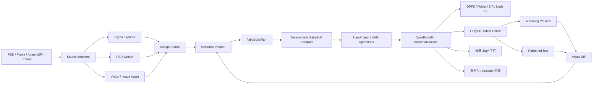

# 结论

可以实现，而且你现在的 **OpenFairyGUI + FairyGUI Editor Online** 已经拥有最重要的工程底座。

不建议把它做成：

```text
PSD / FIG / 图片
    ↓
LLM 直接生成 FairyGUI XML
```

更合理的产品形态是：

> **Design-to-FairyGUI Compiler + Agent Studio**

也就是把 OpenFairyGUI 定位为稳定的 FairyGUI 工程内核，在它上面增加一个“设计文件解析、语义规划、确定性编译、视觉校验”的上游系统：

```text
OpenFairyGUI
  = FairyGUI 工程协议、UAM、事务、验证、保存、发布

Design Compiler
  = PSD/Figma/图片 → 中间设计模型 → FairyGUI 构建计划 → UAM

FairyGUI Editor Online
  = 导入审查、预览、人工修正、Undo/Redo、发布测试

Agent / MCP
  = 语义识别、组件化决策、视觉评审、增量修正
```

OpenFairyGUI 已经能够读取和写回 `.fairy`、管理图片等二进制资源、通过 UAM Transaction 修改 Package、Component、DisplayList、Controller、Transition 和 Gear，并提供 Backend、CLI 与 MCP，因此不需要重新实现 FairyGUI 工程格式。

---

# 一、应该借鉴 OpenDesign 的哪些部分

不要直接 Fork OpenDesign。OpenDesign 的主要工件是 HTML/CSS，预览和编辑建立在 iframe、DOM 与浏览器渲染之上；FairyGUI 的事实来源则应该是 UAM 和标准 `.fairy` 工程。

更适合借鉴它的架构思想：

| OpenDesign 概念        | FairyGUI 系统中的对应物                               |
| -------------------- | ---------------------------------------------- |
| Coding Agent Runtime | Codex、Claude Code 等外部 Agent，通过 MCP 调用          |
| `DESIGN.md`          | `DESIGN.md` + `FAIRYGUI.md`                    |
| Design Template      | FairyGUI 项目模板、Screen 模板、组件模板                   |
| Skill                | Figma 导入、PSD 导入、组件化、视觉评审 Skill                 |
| Plugin               | Source Adapter、Mapping Pack、Design System Pack |
| Artifact             | `UamProject`、`.fairy` 工程、发布包                   |
| HTML iframe Preview  | FairyGUI Authoring Preview / Published Test    |
| DOM Patch            | UAM Transaction                                |
| 文件是事实来源              | `.fairy` 工程和资源文件是事实来源                          |
| Critique Loop        | 参考图与 FairyGUI 渲染截图的视觉对比循环                      |

尤其应该复用 OpenDesign 的一个原则：

> Agent 负责理解与规划，确定性程序负责生成最终工程。

OpenDesign 本身也将完整 Agent Loop 委托给已有 CLI，自己主要负责检测、上下文、工作目录、流式事件和交付，而不是重新实现 Agent。

---

# 二、整体架构



其中最重要的是中间的两层：

```text
DesignBundle
    ↓
FairyBuildPlan
    ↓
UAM
```

不要让三种输入格式直接分别生成 UAM，否则以后每增加一种输入源，都需要重新实现大量 FairyGUI 映射逻辑。

---

# 三、需要两套中间模型，而不是直接把所有内容塞进 UAM

## 1. DesignBundle：输入无关的设计模型

Figma、PSD 和图片生成最终都应该统一输出一个版本化 Bundle，例如：

```text
MainMenu.fgdesign.zip
├── manifest.json
├── scene.json
├── assets/
│   ├── 67a44d-background.png
│   ├── 2b19e0-button.png
│   └── 3c18f1-icon.png
├── references/
│   └── MainMenu.png
├── fonts.json
├── tokens.json
└── diagnostics.json
```

核心结构可以设计成：

```ts
export interface DesignBundle {
  specVersion: 'openfairygui-design/v1';

  source: {
    kind: 'figma' | 'psd' | 'agent' | 'image';
    documentId: string;
    revision?: string;
  };

  canvases: DesignCanvas[];
  assets: Record<string, DesignAsset>;
  tokens?: DesignTokens;
  diagnostics: DesignDiagnostic[];
}

export interface DesignNode {
  id: string;
  name: string;

  kind:
    | 'canvas'
    | 'frame'
    | 'group'
    | 'text'
    | 'shape'
    | 'vector'
    | 'bitmap'
    | 'component'
    | 'instance';

  bounds: {
    x: number;
    y: number;
    width: number;
    height: number;
  };

  transform?: [number, number, number, number, number, number];
  opacity: number;
  visible: boolean;
  blendMode?: string;

  text?: DesignText;
  appearance?: DesignAppearance;
  layout?: DesignLayout;
  assetId?: string;
  children: string[];

  semantic?: {
    role?: 'button' | 'label' | 'list-item' | 'dialog' | 'icon' | 'background';
    componentKey?: string;
    state?: string;
    confidence: number;
  };

  rasterFallback?: {
    assetId: string;
    reason: string;
  };
}
```

DesignBundle 必须保留：

* 原始 Source Node ID；
* 原始坐标；
* 层级；
* 样式；
* 文本；
* 资源引用；
* 推断语义；
* 推断置信度；
* 无法表达时的栅格化资源；
* 参考截图。

## 2. FairyBuildPlan：FairyGUI 语义规划模型

Agent 不应该直接输出完整 `UamProject`。UAM 很详细，包含大量默认字段、数字枚举、引用和资源 ID，模型很容易产生：

* 悬空引用；
* 重复 ID；
* 错误 Package ID；
* Controller/Gear 页面不一致；
* 不存在的资源；
* 不合法的 DisplayList 顺序。

应该让 Agent 输出一个更小、更语义化的计划：

```ts
export interface FairyBuildPlan {
  specVersion: 'openfairygui-build-plan/v1';

  profile: {
    fidelity: 'pixel' | 'hybrid' | 'semantic';
    targetRuntime: 'layabox' | 'unity' | 'cocos' | 'generic';
    componentization: 'conservative' | 'balanced' | 'aggressive';
  };

  packages: FairyPackagePlan[];
  resources: FairyResourcePlan[];
  components: FairyComponentPlan[];
  interactions: InteractionIntent[];
  diagnostics: BuildDiagnostic[];
  sourceMappings: SourceMapping[];
}
```

例如，Agent 输出：

```json
{
  "componentKey": "main-menu",
  "name": "MainMenu",
  "package": "Main",
  "size": [1920, 1080],
  "children": [
    {
      "key": "background",
      "type": "image",
      "asset": "background-image",
      "bounds": [0, 0, 1920, 1080]
    },
    {
      "key": "title",
      "type": "text",
      "text": "START GAME",
      "fontSize": 64,
      "bounds": [650, 180, 620, 90]
    },
    {
      "key": "start-button",
      "type": "component-instance",
      "component": "common/start-button",
      "bounds": [720, 620, 480, 120]
    }
  ]
}
```

然后由确定性 Compiler：

* 分配 FairyGUI ID；
* 补齐默认属性；
* 处理 Package 引用；
* 生成资源；
* 创建 Controller/Gear；
* 决定 DisplayList 顺序；
* 写入 `sourceBytes`；
* 生成 UAM；
* 执行完整验证。

---

# 四、三种输入源应该分别怎样实现

## 1. Figma：优先实现 Figma Plugin Exporter

第一版不建议直接解析 `.fig` 二进制文件。

推荐顺序是：

```text
Figma Plugin Export
    ↓
fgdesign.zip
    ↓
FairyGUI Design Studio
```

Figma 官方提供完整的 TypeScript Plugin API 示例，涵盖节点遍历、图片读取、Variables、Codegen 和 Plugin UI 通信，因此建立自己的导出插件是稳定性更高的路径。

Figma 插件负责导出选中的 Frame，而不是默认导出整个文件：

```text
Figma Node
├── ID / Name / Type
├── Absolute Transform
├── Bounds
├── Auto Layout
├── Constraints
├── Fill / Stroke / Effects
├── Text Runs
├── Component / Instance Key
├── Component Properties
├── Variables / Styles
├── Prototype Interactions
└── PNG / SVG Raster Assets
```

建议提供三种 Figma 导入方式：

| 方式                   | 定位                |
| -------------------- | ----------------- |
| Figma Plugin 导出      | 第一优先，语义最完整        |
| Figma URL + REST API | 后续 Headless/CI 使用 |
| 本地 `.fig` 二进制解析      | 实验性，不作为第一版主路径     |

### Figma 映射建议

| Figma                        | FairyGUI                                 |
| ---------------------------- | ---------------------------------------- |
| Page                         | 导入命名空间，不一定直接成为 Package                   |
| 顶层 Frame                     | Screen Component                         |
| Component                    | Component Resource                       |
| Instance                     | Component Display Node                   |
| Component Set / Variants     | Controller + Gear，或多个 Component          |
| Text                         | `text` / `richText`                      |
| Input-like component         | `textInput`                              |
| Rectangle / Ellipse          | `graph`                                  |
| 复杂 Vector / Gradient         | PNG 图片资源                                 |
| Auto Layout                  | Component + Group Layout + Relations     |
| Repeated Component Instances | List + Item Component                    |
| Clip Content                 | Component Overflow / Mask                |
| Prototype State              | Controller                               |
| Smart Animate                | Transition 的近似实现                         |
| 页面导航                         | 单独的 Interaction Binding，不直接塞进 Controller |

需要特别区分：

```text
按钮 Normal / Pressed / Disabled
    → Controller + Gear

从 Login 页面跳转到 Home 页面
    → 应用层导航绑定，不是 Controller
```

屏幕导航、数据绑定和业务事件建议输出到：

```text
bindings/
├── interactions.json
└── generated-layabox.ts
```

FairyGUI 工程负责界面结构和状态，不负责猜测完整业务逻辑。

---

## 2. PSD：浏览器解析 + Photoshop 高保真导出两条路线

浏览器端可先使用 `ag-psd`：

```text
PSD ArrayBuffer
    ↓ Web Worker
ag-psd
    ↓
图层树 + 文本 + 像素资源
    ↓
DesignBundle
```

`ag-psd` 支持 Node、浏览器和 Web Worker，也支持跳过部分图像解码、延迟解码和内存预算设置；但它明确存在文本层不完整、不支持 PSB、部分颜色模式、新版 Photoshop 功能和复杂图层效果等限制。

因此 PSD 应该设计两种模式：

### Portable 模式

完全在浏览器解析：

* 读取图层树；
* 提取图层 PNG；
* 读取基础文本信息；
* 保留坐标、可见性、透明度和部分 Blend Mode；
* 不支持的图层组自动栅格化；
* 大文件先只读取结构，用户选择 Artboard 后再解码对应像素。

### High Fidelity 模式

额外制作 Photoshop 插件导出器：

```text
Photoshop
    ↓ 插件
规范化图层 JSON + 精确导出 PNG/SVG
    ↓
fgdesign.zip
```

高保真模式可以让 Photoshop 自身处理：

* 智能对象；
* 图层样式；
* Pattern；
* 文本实际渲染；
* 剪贴蒙版；
* 新版效果；
* 复杂混合。

### PSD 图层命名约定

PSD 本身通常缺乏 Auto Layout、Component、Variant 等高级语义，所以应该支持图层标注：

```text
@fgui component
@fgui role=button
@fgui list-item
@fgui state=pressed
@fgui 9slice=16,16,16,16
@fgui rasterize
@fgui ignore
@fgui export
```

例如：

```text
StartButton @fgui component role=button
├── Background @fgui 9slice=24,24,24,24
├── Label
├── Pressed @fgui state=pressed
└── Disabled @fgui state=disabled
```

未标注时再由 Agent 推断，但显式标注的优先级必须高于 AI。

---

## 3. Agent 生图：尽量让 Agent 输出“分层设计包”，而不是只输出一张图

最差的输入形式是：

```text
一张扁平 PNG
```

因为它无法告诉系统：

* 哪些节点是按钮；
* 哪些元素应该复用；
* 背景被按钮遮住的位置是什么；
* Normal/Pressed/Disabled 状态是什么；
* 精确字体是什么；
* 哪些是 List；
* 哪些元素应该 9-Slice；
* 动画和交互是什么。

因此 Agent 原生生成应该改成：

```text
用户 Prompt
    ↓
Agent 先生成结构化 UI Plan
    ↓
图像模型只生成插画、背景、图标、皮肤
    ↓
Agent 输出 DesignBundle
    ↓
Compiler 组合成 FairyGUI
```

理想的 Agent 输出：

```text
agent-output/
├── scene.json
├── preview.png
├── assets/
│   ├── background.png
│   ├── logo.png
│   ├── button-normal.png
│   ├── button-pressed.png
│   └── icon-settings.png
└── design-tokens.json
```

UI 文本、简单矩形、进度条、列表和布局尽量由 FairyGUI 原生节点完成，图片模型主要负责：

* 插画；
* 背景；
* 图标；
* 装饰边框；
* 复杂皮肤；
* 角色和物品；
* 按钮视觉状态。

不要让图片模型直接生成最终图集。应生成独立透明素材，再交给 FairyGUI Publisher 统一打包 Atlas。

### 只有一张参考图时

进入“视觉重建模式”：

```text
OCR
→ UI 区域检测
→ 元素分割
→ 重复结构检测
→ 组件角色推断
→ 图层资产提取 / 背景修复
→ DesignBundle
```

这种模式必须带置信度：

```ts
{
  role: 'button',
  confidence: 0.76,
  reason: 'rounded container containing centered short text'
}
```

低置信度节点不能静默转换，应进入 Mapping Review：

* Text 或 Image；
* Button 或普通 Component；
* List 或多个独立节点；
* 原生 Graph 或栅格图；
* 是否 9-Slice；
* 是否复用现有组件。

---

# 五、FairyGUI 映射规则

OpenFairyGUI 的 UAM 当前覆盖 image、text、richText、textInput、component、list、tree、graph、group、loader、movieClip、button、label、comboBox、progressBar、slider 和 scrollBar 等节点，也包含资源、Controller、Transition 和 Gear 模型。

推荐使用下面的映射优先级。

## 原生表达优先

| 视觉内容           | 首选 FairyGUI 表达                          |
| -------------- | --------------------------------------- |
| 纯色矩形、圆角、描边     | `graph`                                 |
| 普通文本           | `text`                                  |
| 富文本            | `richText`                              |
| 输入框            | `textInput`                             |
| 图片             | Image Resource + `image`                |
| 远程动态图片         | `loader`                                |
| 复用 UI          | Component Resource + Component Instance |
| 规则重复项          | List + Item Component                   |
| 按钮             | Button Extension Component              |
| 进度条            | ProgressBar Extension                   |
| 状态变化           | Controller + Gear                       |
| 时间动画           | Transition                              |
| 同级布局分组         | Group                                   |
| 独立裁剪、局部坐标、复杂布局 | 子 Component                             |

需要注意：

> Figma/PSD 的 Group 不应该全部映射成 FairyGUI Group。

FairyGUI Group 更接近“同一 Component 中多个兄弟节点的布局分组”，并不等价于任意嵌套容器。以下情况应该生成子 Component：

* 独立坐标空间；
* Clip；
* Mask；
* 独立 Auto Layout；
* 自己拥有 Controller；
* 需要复用；
* 需要滚动；
* 复杂 Transform。

## 无法原生表达时的回退顺序

```text
1. FairyGUI 原生节点
2. 多节点组合 Component
3. 栅格化最小的不支持子树
4. 整个区域栅格化
5. 整屏参考图，仅作为最后兜底
```

原则是：

> 栅格化最小的不支持子树，不要因为一个阴影或渐变把整个屏幕压成图片。

OpenFairyGUI 的 UAM 图片资源支持 `scale9Grid`，Component Properties 也已经包含 `designImage`、透明度、偏移和测试参考图字段，因此可以把原始 Figma Frame、PSD Artboard 或 Agent Preview 设置成 FairyGUI 的设计参考图，用于叠加校准。

---

# 六、提供三种编译策略

这是产品中应该让用户明确选择的选项。

## Pixel Fidelity

```text
视觉保真优先
复杂区域大量栅格化
```

适合：

* 纯展示界面；
* 营销页面；
* 快速导入；
* 复杂游戏皮肤。

缺点是可编辑性低。

## Hybrid，建议默认

```text
文本、按钮、列表、简单形状原生
复杂背景、特效、插画栅格化
```

这是最适合实际 FairyGUI 项目的模式。

## Semantic

```text
组件化、原生节点和状态语义优先
```

适合：

* 要长期维护的游戏 UI；
* 多分辨率适配；
* 本地化；
* 大量运行时动态内容；
* 设计系统复用。

视觉可能和源图略有偏差，但工程质量最好。

---

# 七、OpenFairyGUI 在编译链路中的正确用法

OpenFairyGUI 已经提供了创建 Package、Resource、Component、DisplayNode、Controller、Transition 和 Gear 的 Transaction Operation，包括：

* `addPackage`
* `addResource`
* `addComponent`
* `attachDisplayNode`
* `setDisplayNodeProps`
* `replaceResourceBytes`
* `addController`
* `addTransition`
* `addGear`

并且支持 Preflight、Selector 检查、引用验证和错误定位。

## 新项目：直接编译成完整 UamProject

初次创建时，不必把数千个节点逐条作为 Transaction 应用。

```text
FairyBuildPlan
    ↓
完整 UamProject
    ↓
validateProjectWeb
    ↓
openProjectSession
    ↓
materializeSession
```

示意代码：

```ts
import {
  createDefaultUamComponentProperties,
  createDefaultUamImageResourceProperties,
  createDefaultUamPlainTextProperties,
  type UamProject,
} from '@openfairygui/core';

import {
  BackendRuntime,
  createBackendStorageFileSystem,
} from '@openfairygui/backend';

import { validateProjectWeb } from '@openfairygui/functions/web';

const project: UamProject = await compiler.compileNewProject({
  bundle,
  buildPlan,
  assetStore,
});

// UAM、引用和已水合图片验证
const report = await validateProjectWeb(project);

if (report.status !== 'valid') {
  throw new Error(JSON.stringify(report.diagnostics, null, 2));
}

const fileSystem = createBackendStorageFileSystem(storageAdapter);
const runtime = new BackendRuntime();

const opened = runtime.openProjectSession({
  project,
  storage: {
    fileSystem,
    fairyPath: 'GeneratedUI/GeneratedUI.fairy',
  },
});

if (!opened.ok) {
  throw new Error(opened.error.message);
}

const materialized = await runtime.materializeSession({
  sessionId: opened.data.sessionId,
  expectedRevision: opened.data.revision,
  mode: 'fullProject',
  reason: 'design_import',
});

if (!materialized.ok) {
  throw new Error(materialized.error.message);
}
```

`BackendRuntime` 已支持内存中的权威 UAM 项目、浏览器异步存储适配器、OPFS/IndexedDB/File System Access API、Revision、锁、保存和完整工程物化。

OpenFairyGUI 的测试工具中已经有通过默认属性 Builder 构造最小有效 UAM 工程的实例，可以直接以其结构作为 Compiler 的第一批 Fixture。

## 增量修改：生成 UAM Operations

完成首次创建后，Agent 或视觉校验产生的修改应该走 Transaction：

```ts
const applied = await runtime.applyTransaction({
  sessionId,
  expectedRevision,
  operations: [
    {
      opId: 'visual-fix:title-position',
      kind: 'setDisplayNodeProps',
      selector: {
        packageId: 'pkg-main',
        componentResourceId: 'cmp-main-menu',
        displayNodeId: 'node-title',
      },
      props: {
        position: { x: 620, y: 174 },
        size: { width: 680, height: 96 },
      },
    },
  ],
});
```

每个 Operation 都带 `opId`，方便把错误关联回：

* Source Node；
* Build Plan；
* Agent 决策；
* 视觉差异；
* 用户操作。

## 修改已有工程

已有工程必须通过 `openSession()` 从真实存储打开，让 Backend 检查 UAM 写回保真度；不能把读取后的 UAM 假装成一个全新的权威项目。Backend 在检测到持久化属性无法通过 UAM 保真表达时，会拒绝写回而不是静默破坏源工程。

---

# 八、Agent 不应该直接操作完整 UAM

推荐分工：

| Agent 负责          | 确定性程序负责                     |
| ----------------- | --------------------------- |
| 判断某区域是不是 Button   | 创建 Button Component         |
| 推断哪些元素应复用         | 分配稳定 Component ID           |
| 判断 Variant 是否属于状态 | 创建 Controller Page          |
| 分析视觉差异            | 生成合法 Gear                   |
| 推断 List Item      | 创建 List 和 Item 引用           |
| 选择栅格化区域           | 生成图片资源和 Source Bytes        |
| 生成图像素材            | 资源 Hash、路径和去重               |
| 生成修正意图            | UAM Preflight 和 Transaction |
| 视觉评审              | `.fairy` 写入和发布              |

对 Agent 暴露的应该是窄工具：

```text
openfairygui_design_import_source
openfairygui_design_get_outline
openfairygui_design_create_plan
openfairygui_design_validate_plan
openfairygui_design_apply_plan
openfairygui_design_render_component
openfairygui_design_compare_reference
openfairygui_design_apply_visual_patch
openfairygui_design_publish
```

而不是：

```text
write_arbitrary_xml
execute_script
replace_whole_project_json
```

OpenFairyGUI MCP 当前已经存在打开 Session、验证 Session、应用 Transaction 和保存 Session 等基础工具，因此新的 Design MCP 可以作为上层 Facade，内部调用现有 Backend 工具，不需要复制底层能力。

---

# 九、Agent Skill 的组织方式

建议先做三份核心 Skill，而不是把所有内容塞进一个 `SKILL.md`。

```text
skills/
├── fairygui-design-planner/
│   ├── SKILL.md
│   ├── references/
│   │   ├── figma-mapping.md
│   │   ├── psd-mapping.md
│   │   ├── componentization.md
│   │   └── raster-fallback.md
│   ├── schemas/
│   │   └── build-plan.schema.json
│   └── evals/
│
├── fairygui-project-author/
│   ├── SKILL.md
│   ├── references/
│   │   ├── uam-authoring.md
│   │   ├── controller-gear.md
│   │   ├── transition.md
│   │   └── resource-policy.md
│   └── evals/
│
└── fairygui-visual-critic/
    ├── SKILL.md
    ├── references/
    │   ├── visual-diff.md
    │   └── typography-validation.md
    └── evals/
```

工作流：

```text
design-planner
    ↓
project-author
    ↓
visual-critic
    ↓
project-author 生成修正 Transaction
```

---

# 十、设计系统应该怎样设计

借鉴 OpenDesign 的 `DESIGN.md`，但 FairyGUI 还需要额外的工程约束。

```text
design-system/
├── DESIGN.md
├── FAIRYGUI.md
├── tokens.json
├── component-map.json
├── assets/
└── previews/
```

## DESIGN.md

描述：

* 品牌语言；
* 色彩；
* 字体；
* 留白；
* 圆角；
* 阴影；
* 视觉密度；
* 图标风格。

## FAIRYGUI.md

描述：

* 基准分辨率；
* Safe Area；
* Package 划分；
* 命名约定；
* Component Extension 约定；
* Controller 名称；
* 按钮状态名称；
* Relation 和适配策略；
* Atlas 规则；
* 9-Slice 规则；
* 图片格式；
* 字体资源策略；
* 多语言策略；
* 目标 Runtime；
* 生成代码选项；
* 栅格化策略。

## component-map.json

这是非常关键的能力：

```json
{
  "figmaComponents": {
    "23:418": "ui://Common/ButtonPrimary",
    "23:512": "ui://Common/IconButton",
    "23:700": "ui://Common/Dialog"
  },
  "semanticRoles": {
    "primary-button": "ui://Common/ButtonPrimary",
    "close-button": "ui://Common/ButtonClose"
  }
}
```

Compiler 应先查找现有 FairyGUI 组件，再决定是否创建新组件：

```text
精确 Figma Component Key
→ Design System 映射
→ 名称和语义匹配
→ 视觉相似度匹配
→ 创建新 Component
```

这会比单纯“把设计图转成节点”更有长期价值。

---

# 十一、如何集成 FairyGUI Editor Online

FairyGUI Editor Online 已经具备：

* Browser Project Session；
* OPFS / IndexedDB；
* Folder / ZIP 导入；
* Typed Transaction；
* Undo/Redo；
* Authoring Canvas；
* Published Test；
* Controller、Transition、Gear 编辑；
* 资源编辑；
* 保存后重新读取验证。

因此建议新增一个第一方 `Design Import` 模块，而不是重新做编辑器。

模块界面可以是：

```text
┌──────────────────────────────────────────────────────────┐
│ Source     Mapping     Build Plan     Diagnostics        │
├───────────────┬──────────────────────┬───────────────────┤
│ Source Tree   │ FairyGUI Canvas      │ Agent / Inspector │
│               │                      │                   │
│ Figma/PSD     │ Reference Overlay    │ Low Confidence    │
│ Layer Tree    │ Generated Result     │ Fonts             │
│               │ Diff Heatmap         │ Raster Fallbacks  │
├───────────────┴──────────────────────┴───────────────────┤
│ Build · Apply Patch · Validate · Publish · Export ZIP    │
└──────────────────────────────────────────────────────────┘
```

新增服务：

```text
SourceImportService
DesignBundleService
SemanticPlannerService
FairyCompilerService
SourceMappingService
VisualDiffService
AgentOrchestratorService
```

但所有工程修改仍必须进入现有的：

```text
ProjectSession
→ Transaction Queue
→ Undo/Redo
→ Save
```

Importer 不能绕过 Session 直接写项目文件。

---

# 十二、视觉评审闭环

每个 Screen Component 同时保存：

1. 原始参考图；
2. 当前 UAM；
3. Authoring Preview 截图；
4. Published Runtime 截图。

评审流程：

```text
源参考图
    ↓
统一尺寸 / DPR / 字体环境
    ↓
FairyGUI Published Preview 截图
    ↓
像素差异 + 几何差异 + 文本差异
    ↓
结构化问题
    ↓
Agent 生成修正意图
    ↓
UAM Transaction
```

结构化问题示例：

```json
{
  "code": "text_bounds_mismatch",
  "sourceNodeId": "figma:23:998",
  "displayNodeId": "node-title",
  "expected": {
    "x": 620,
    "y": 170,
    "width": 680,
    "height": 96
  },
  "actual": {
    "x": 635,
    "y": 176,
    "width": 650,
    "height": 88
  },
  "confidence": 0.97
}
```

不要只给 Agent 一张 Diff Heatmap，还要提供：

* Source Node ID；
* FairyGUI Node ID；
* Bounds；
* 字体和字号；
* 当前 UAM 属性；
* 支持的修正操作；
* 是否为用户手工修改节点。

OpenFairyGUI 已经提供不修改项目的 UAM 验证函数，浏览器侧还可验证已水合图片，因此可以在视觉比较前后分别执行结构验证。

---

# 十三、增量重新导入必须提前设计

第一版可以只支持一次性生成，但 Source Mapping 要从一开始保留。

```ts
export interface SourceMapping {
  sourceDocumentId: string;
  sourceNodeId: string;
  sourceHash: string;

  target: {
    packageId: string;
    resourceId?: string;
    componentResourceId?: string;
    displayNodeId?: string;
  };

  ownership: {
    sourceOwnedFields: string[];
    userOwnedFields: string[];
  };
}
```

稳定 ID 不应根据节点名称生成，而应根据：

```text
sourceDocumentId + sourceNodeId
```

例如：

```ts
stableId = base32(
  sha256(`${sourceDocumentId}:${sourceNodeId}`)
).slice(0, 8);
```

重新导入时做三方比较：

```text
上一次 Source Snapshot
当前 Source Snapshot
当前 FairyGUI UAM
```

结果分为：

* Source 改了、用户没改：自动更新；
* Source 没改、用户改了：保留用户修改；
* Source 和用户都改了：产生冲突；
* Source 节点删除、用户有修改：要求确认；
* Source 新增：自动创建。

映射表应存入独立 Sidecar；节点 `customData` 可以镜像 Source ID，但不应成为唯一事实来源。

---

# 十四、推荐仓库结构

不建议把 PSD、Figma、AI 和视觉模型依赖直接放入 OpenFairyGUI Core。

建议新建产品仓库，并尽量保持 Package 数量精简：

```text
FairyGUI-Design-Studio/
├── apps/
│   ├── studio/                 # 基于 Editor Online 的产品
│   └── figma-plugin/           # Figma Exporter
│
├── packages/
│   ├── design-compiler/
│   │   ├── src/ir/
│   │   ├── src/importers/
│   │   │   ├── figma/
│   │   │   ├── psd/
│   │   │   └── image/
│   │   ├── src/planner/
│   │   ├── src/compiler/
│   │   ├── src/mapping/
│   │   ├── src/visual-qa/
│   │   └── src/security/
│   │
│   └── agent-kit/
│       ├── src/tools/
│       ├── src/mcp/
│       └── src/runtime/
│
├── skills/
├── design-systems/
├── fixtures/
└── e2e/
```

初期甚至可以只有：

```text
apps/studio
apps/figma-plugin
packages/design-compiler
```

Agent Tools 先放在 Studio 内部，接口稳定后再拆 `agent-kit`。

OpenFairyGUI 继续保持：

```text
core
→ functions
→ backend
→ mcp / cli
```

只有真正通用的 UAM Builder、Transaction 能力缺口或验证能力，才回馈到 OpenFairyGUI 主仓库。

---

# 十五、最合理的实施顺序

## 阶段 0：先做确定性 Compiler

暂时不接 Figma、PSD 和 AI。

手写一个 `scene.json`，实现：

```text
scene.json
→ DesignBundle
→ FairyBuildPlan
→ UamProject
→ validate
→ materialize
→ Editor Online Preview
```

第一版只支持：

* 一个 Package；
* 一个 Screen Component；
* Image；
* Text；
* Graph；
* 子 Component；
* 参考图 Overlay；
* ZIP 导出。

## 阶段 1：Figma Plugin

支持：

* 用户选择一个或多个 Frame；
* Frame → Component；
* Text；
* Image；
* Simple Shape；
* Component / Instance；
* 基础 Auto Layout；
* Reference Screenshot；
* Stable Source ID。

这是最适合验证完整链路的输入源，因为语义最丰富。

## 阶段 2：组件状态与设计系统

增加：

* Component Set；
* Button；
* Controller；
* Gear；
* Transition；
* Component Library Mapping；
* List 和 List Item；
* Relations；
* 9-Slice。

## 阶段 3：PSD

增加：

* Web Worker；
* 图层树；
* Artboard；
* 文本层；
* 图层 PNG；
* 标注语法；
* 最小子树栅格化；
* Photoshop 高保真 Exporter。

## 阶段 4：Agent 原生生成

先实现：

```text
Prompt → Scene JSON + 独立 Assets
```

再实现：

```text
扁平图片 → Vision Reconstruction
```

不要反过来。

## 阶段 5：增量同步

增加：

* Source Mapping；
* 三方 Diff；
* 字段 Ownership；
* 冲突处理；
* Source Reimport；
* 手工修改保护。

## 阶段 6：Agent 视觉闭环

增加：

* 自动截图；
* Source Overlay；
* Diff；
* Visual Critic；
* Transaction Patch；
* 有限次数自动迭代；
* Published Runtime 验证。

---

# 十六、第一条最值得实现的垂直切片

最合适的第一个可交付链路是：

```text
Figma 中选择一个 1920×1080 Frame
    ↓
Figma Plugin 导出 fgdesign.zip
    ↓
Studio 解析：
  Text
  Image
  Rectangle
  Group
  Component Instance
    ↓
生成：
  Main Package
  MainView Component
  图片资源
  原生文本
  原生 Graph
  子组件引用
    ↓
设置原始 Frame 为 designImage
    ↓
OpenFairyGUI validateProjectWeb
    ↓
BackendRuntime materializeSession
    ↓
FairyGUI Editor Online 打开
    ↓
叠加参考图
    ↓
导出标准 FairyGUI ZIP
```

这条链路跑通后，再增加 Button Controller、List、PSD 和图片反向重建。不要一开始同时攻克 `.fig` 二进制解析、PSD 全效果、视觉识别、自动组件化和增量同步，否则主线会迅速分散。

最终产品的真正壁垒不会是“能生成 `.fairy` 文件”，而会是：

> **设计语义识别、现有 FairyGUI 组件复用、最小栅格化、稳定增量同步，以及渲染结果与源设计之间的自动视觉修正闭环。**
